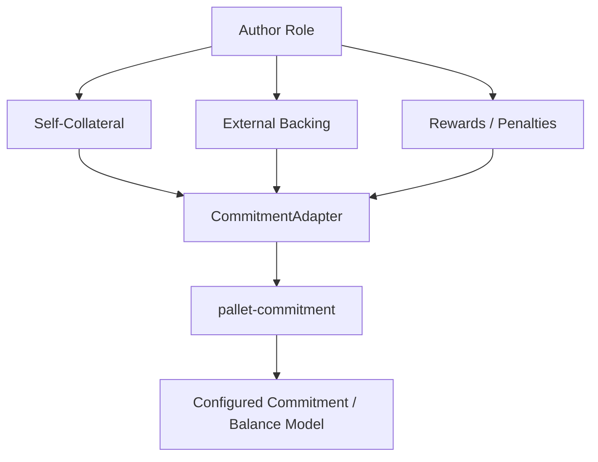
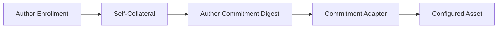
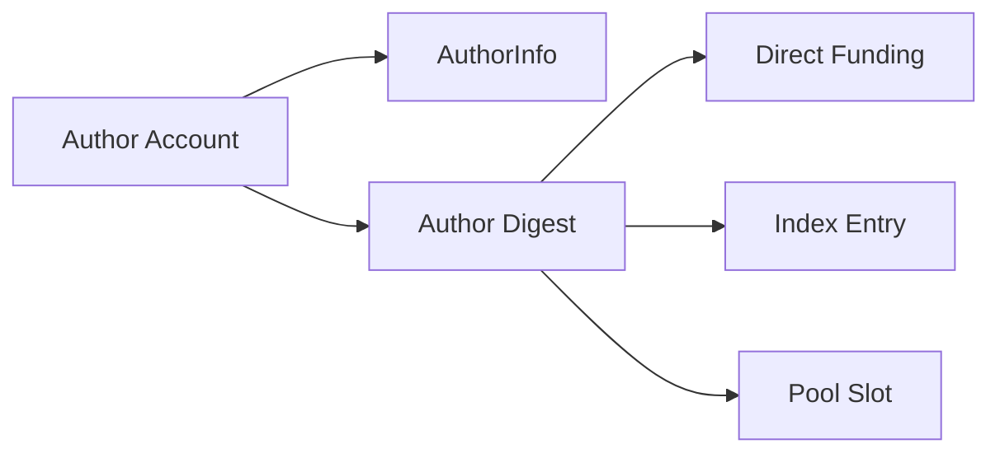
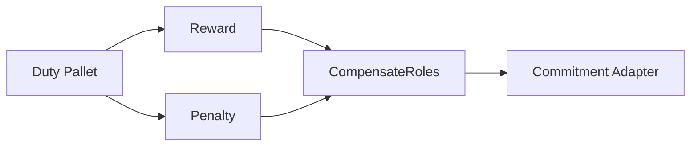
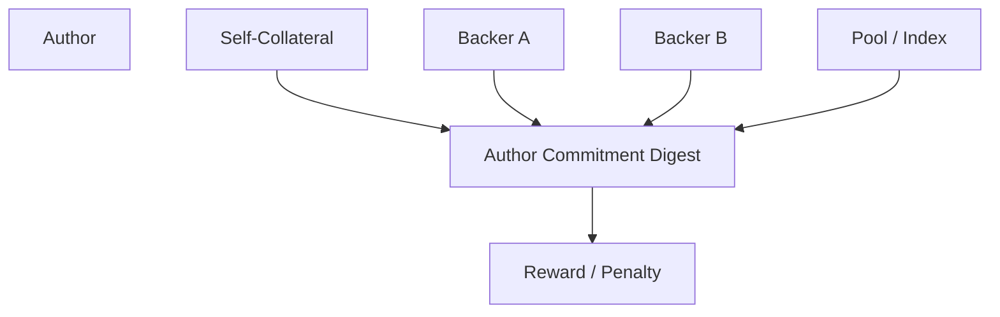
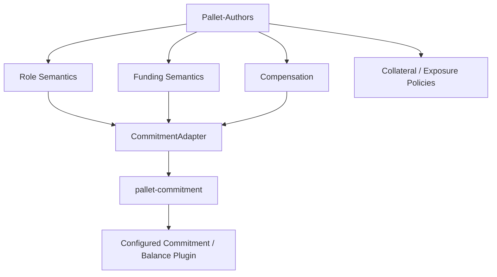

# 💰 Commitments 

From the perspective of **Pallet-Authors**, the commitment system is the economic foundation underneath the Author role.

Pallet-Authors does not implement its own balance, locking, backing, or resolution model. Instead, it connects the Author role to a configured **`CommitmentAdapter`**, which provides the commitment primitives required by the pallet. 

This makes the architecture:



The important idea is:

> **Pallet-Authors defines why an economic commitment exists; `pallet-commitment` defines how that commitment exists.**

---

## 🔌 The Commitment Adapter

The runtime configures a single `CommitmentAdapter` for Pallet-Authors.

Conceptually, it is required to provide the commitment capabilities needed by the Author role:

```rust
type CommitmentAdapter:
    Commitment<Author<Self>>
    + CommitIndex<Author<Self>>
    + CommitPool<Author<Self>>
    + InspectAsset<Author<Self>>;
```

This means the adapter is not merely a balance interface. It provides several economic views of the same commitment architecture:

| Capability     | Used by Pallet-Authors for                 |
| -------------- | ------------------------------------------ |
| `Commitment`   | Author commitments and ordinary backing    |
| `CommitIndex`  | Index-based external backing               |
| `CommitPool`   | Pool-based external backing                |
| `InspectAsset` | Inspecting the underlying commitment asset |

These capabilities are all attached to the **Author** as the role being economically represented. 

---

## 🪙 The Role Asset

The commitment configuration also determines **which asset economically represents the Author role**.

Pallet-Authors' configured `Asset` is required to agree with the asset exposed by the commitment adapter:

```rust
type Asset: Inspect<
    Author<Self>,
    Balance = <Self::CommitmentAdapter as InspectAsset<Author<Self>>>::Asset,
>
+ Mutate<Author<Self>>
+ UnbalancedHold<Author<Self>>;
```

This creates an important invariant:

> **The asset used by Author operations and the asset understood by the commitment system are the same economic asset.**


Therefore, Pallet-Authors can configure *which asset* backs the role without embedding a particular balance implementation into the role logic.

---

## 🧱 Self-Collateral as a Commitment

When an Author enrolls, its self-collateral becomes a commitment rather than simply being recorded as a number in Author storage.

Conceptually:



The Author implementation validates the collateral requirement, obtains or creates the Author's commitment identity, and places the collateral through the adapter. The Author's metadata then references that economic identity. 

This is why the commitment digest is important: the economic position is not required to be represented purely by an account balance.

---

## 🔗 Commitment Identity

An Author has a commitment identity associated with its economic position.

Pallet-Authors maintains the relationship between the Author account and its commitment digest:



This allows commitment-based funding mechanisms to reference the **economic identity of the role**, rather than requiring every funding mechanism to directly depend on the Author account.

The digest mapping is also retained so that indexes and pools can continue referring to the Author's commitment identity independently of the Author's current lifecycle state. 

---

## 🤝 External Backing

From Pallet-Authors' perspective, external backing is simply another commitment associated with an Author.

The actual organization of that commitment is delegated to the adapter:

```text
Backer
  │
  ├── Direct ──────┐
  ├── Index ───────┼──→ Author Commitment
  └── Pool ────────┘
```

This is why `FundRoles` does not need separate accounting implementations for direct, index, and pool backing.

It delegates them to:

```text
Commitment
CommitIndex
CommitPool
```

The same commitment architecture therefore supports multiple ways of expressing economic support without changing the Author role itself. 

---

Add this to the **Rewards and Penalties** section:

## 🎁 Rewards and Penalties

Rewards and penalties also operate through the commitment architecture.

From the Author pallet's perspective, a duty pallet produces an economic consequence:



The reason these consequences are applied through the commitment system is that **all economic support for an Author is represented through its commitment identity**.

An Author's self-collateral and external backing ultimately contribute to the same **Author commitment digest**. Because the commitment system has the complete economic position associated with that digest, a reward or penalty can be applied against the **whole committed position**, rather than only against the Author's own balance.



This is especially important for penalties. If an Author's backing represents the economic support behind its participation, penalizing only the Author's self-collateral would fail to reflect the **full economic position that enabled the Author to participate**.

By operating on the commitment associated with the Author digest, the commitment system can account for the complete committed position, including the external backing attached to that Author.

Likewise, rewards can be reflected through the same committed position rather than requiring Pallet-Authors to maintain a separate reward accounting mechanism.

> **The Author digest provides a single economic point through which the Author's self-collateral and external backing can be collectively affected by the consequences of its duties.**

This is one of the key reasons compensation is built on top of the commitment system rather than directly on top of ordinary account balances.


---

## 🔓 Resolution

A commitment is not necessarily permanent.

When the Author is allowed to resign, Pallet-Authors resolves **the Author's own commitment** through the adapter:

```rust
T::CommitmentAdapter::resolve_commit(
    who,
    reason,
)
```

External commitments are deliberately not resolved as part of Author resignation; they belong to their respective backers. 

This gives the two economic relationships independent lifecycles:

```text
Author
 ├── Self commitment
 │      └── resolved on eligible resignation
 │
 └── External commitments
        ├── Backer A
        ├── Backer B
        └── Pool / Index
              └── resolved according to their commitment rules
```

---

## 🏛️ Economic Safety Through Commitment

Pallet-Authors also builds role-level rules around the commitment system.

For example, `MinCollateral` establishes the minimum economic commitment an Author must maintain. If the commitment falls below that amount, the Author is no longer considered economically fit to perform duties. 

Similarly, funding-level limits such as minimum funding and maximum exposure can constrain how much economic support can be introduced through the role system. 

These are **role policies**, while the underlying movement, holding, commitment, and resolution of assets remain the responsibility of the commitment layer.

---

## 🧠 Why This Separation Exists

Without the commitment abstraction, Pallet-Authors would have to decide:

* What a balance means.
* How backing is represented.
* How indexes work.
* How pools work.
* How commitments are held.
* How rewards and penalties affect commitments.
* How commitments are resolved.
* Which asset implementation is used.

Instead, Pallet-Authors only defines the **economic requirements of the Author role**.



This is the architectural boundary that makes the role system representation-independent.

> **Pallet-Authors decides what must be committed for an Author to exist and participate. The Commitment Adapter decides how that commitment is held, organized, accounted for, rewarded, penalized, and eventually resolved.**
