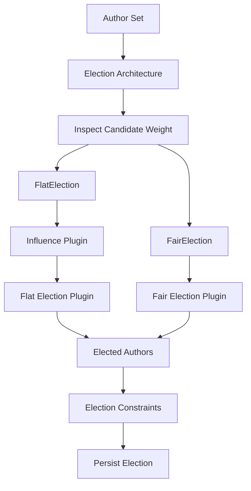
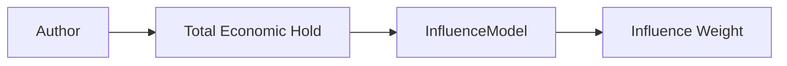
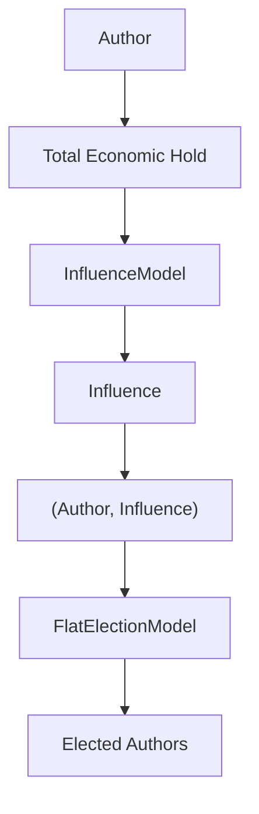
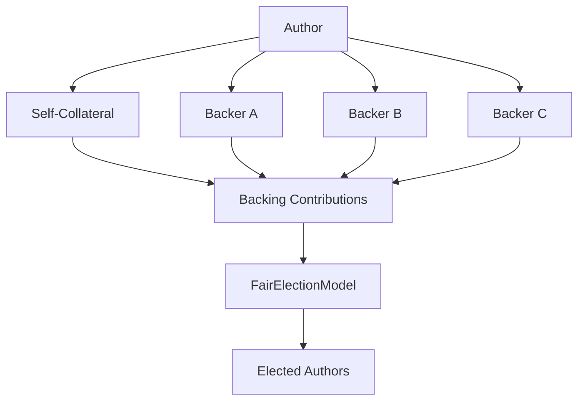
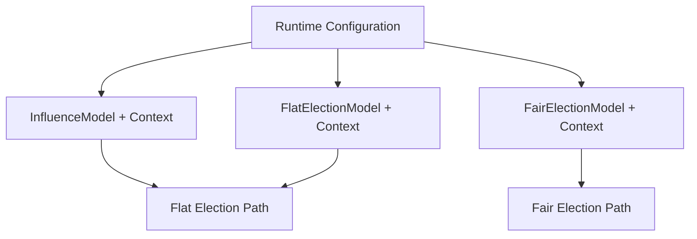
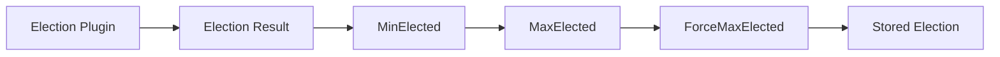
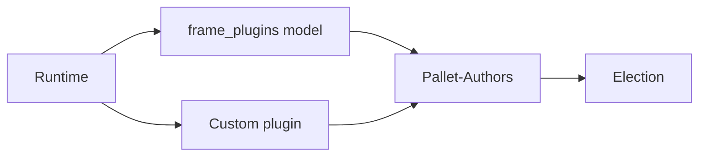
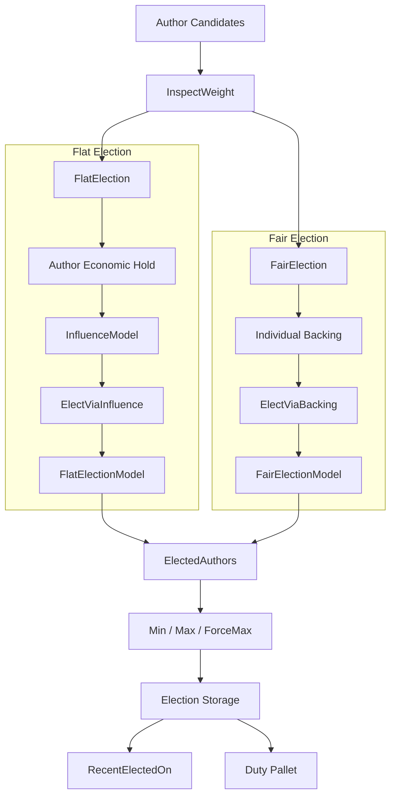

# 🗳️ Election-Manager

The election system (via `frame_suite::elections`) is the part of Pallet-Authors that turns the **set of Authors** into a selectable set of candidates for runtime duties.

An election is not itself a single algorithm. Architecturally, Pallet-Authors provides the election machinery and connects it to the runtime's configured **plugin models**. The actual interpretation of economic support and the algorithm used to select Authors are supplied by those plugins. 

At the pallet level, the election implementation bridges the generic election abstractions with Author-specific state, funding, configuration, storage, and lifecycle rules. 



## 🧱 Election Implementations

Pallet-Authors provides two concrete election implementations:

* `FlatElection`
* `FairElection`

Both implement the generic election abstractions required by the runtime.

The two implementations share the same architectural responsibilities:

1. Inspect the economic position of each candidate.
2. Construct the input expected by the selected election family.
3. Invoke the configured plugin.
4. Validate the resulting candidates.
5. Apply election bounds.
6. Store the resulting election.
7. Record the election round.
8. Emit the corresponding lifecycle events. 

The difference is **what weight representation they expose to the election model**.

---

## ⚖️ Inspect Weight

The `InspectWeight` trait abstraction separates **obtaining a candidate's economic weight** from **running the election**.

This is important because the election algorithm should not need to know how an Author's economic position is stored.

Conceptually:

```rust
trait InspectWeight<Author, Weight> {
    fn weight_of(who: &Author) -> Result<Weight, DispatchError>;
}
```

For `FlatElection`, the implementation obtains the Author's total held economic position through the role compensation interface and passes that value through the configured Influence model. 

Thus:



This means the election layer does not hardcode how economic value becomes voting weight.

---

## 📈 Flat Election

`FlatElection` treats an Author's economic position as **one election weight**.

The position can contain both:

* Self-collateral
* External backing

These are aggregated before the election reaches the election model. 

The pipeline is:



The generic election input is therefore conceptually:

```text
[(Author, Influence)]
```

The `ElectionManager` trait implementation binds this to the configured `FlatElectionModel`, its context, and the `ElectedAuthors` output type. 

## 🔌 Influence Plugin

Flat election has an additional plugin boundary before the election algorithm.

The `InfluenceModel` transforms:

```text
AuthorAsset → Influence
```

The resulting `Influence` is a comparable value that the election algorithm can rank, weight, normalize, or otherwise interpret. 

This gives Flat election **two independent plugin decisions**:

| Plugin              | Input                 | Output           | Responsibility                                             |
| ------------------- | --------------------- | ---------------- | ---------------------------------------------------------- |
| `InfluenceModel`    | `AuthorAsset`         | `Influence`      | Determines how economic exposure becomes influence.        |
| `FlatElectionModel` | `(Author, Influence)` | `ElectedAuthors` | Determines how Authors are selected from those influences. |

This separation is important.

A runtime can change the economic weighting policy without changing the election algorithm, or change the election algorithm without changing how economic exposure becomes influence.

### 🔌 What Are These Plugins?

The plugins used by Pallet-Authors are **not ordinary helper modules or fixed implementations inside the pallet**. They are type-safe, swappable units of behavior provided through, but not confined, via the `frame_suite::plugins` system.

A plugin separates the **operation that Pallet-Authors needs** from the **model that decides how that operation is performed**.

Conceptually:

```text
Pallet-Authors
      │
      │  "I need an election performed"
      ▼
Plugin Contract
      │
      │  resolved against
      ▼
Plugin Model + Context
      │
      ▼
Concrete Behavior
```

The pallet therefore describes the minimum contract it requires, while the selected model provides the actual behavior. The model can also receive a separate **context**, allowing configuration or policy data to participate in the computation. The plugin system resolves this composition at compile time, rather than requiring the pallet to know the concrete implementation. 

For example, an election plugin can conceptually be:

```text
Input + Context
       │
       ▼
   Election Model
       │
       ▼
     Output
```

The runtime chooses which model and context satisfy the pallet's plugin contract:

```rust
type ElectionModel = SomeElectionModel;
type ElectionContext = SomeElectionContext;
```

So Pallet-Authors can invoke the election operation through its generic interface without being coupled to `SomeElectionModel`.

---

## ⚖️ Fair Election

`FairElection` takes a different architectural path.

Instead of first reducing the Author's entire economic position to one influence number, it preserves the **individual backing contributions**.

The input is conceptually:

```text
[(Author, [(Backer, Weight)])]
```

Each backing relationship therefore remains visible to the election plugin. 



Self-collateral can therefore participate as the Author's own backing contribution, while external backers remain individually represented. 

This allows the selected Fair election algorithm to reason about **distribution of support**, not merely total economic exposure.

---

## 🔌 Election Plugins

The actual election algorithm is deliberately outside the pallet's election implementation.

The pallet configuration provides:

```rust
type InfluenceModel;
type InfluenceContext;

type FlatElectionModel;
type FlatElectionContext;

type FairElectionModel;
type FairElectionContext;
```

The corresponding plugin contexts provide model-specific parameters without requiring the pallet itself to know the model's internal policy. 

Architecturally:



The pallet therefore supplies the **data and execution boundary**, while the plugin supplies the **decision logic**.

This is what allows different election algorithms to coexist without embedding them into Pallet-Authors. 

---

## 🧮 Election Manager

`ElectionManager` is the main orchestration boundary implemented for `FlatElection` and `FairElection` on behalf of the plugins.

It does not define *which* election algorithm should win. Instead, it coordinates everything surrounding the algorithm.

```rust
trait ElectionManager<Role> {
    type ElectionWeight;

    fn elect(...);
    fn weight_of(...);
}
```

The important responsibilities are:

| Responsibility            | What the implementation does                                                       |
| ------------------------- | ---------------------------------------------------------------------------------- |
| **Candidate preparation** | Obtains the Authors eligible to participate in the election.                       |
| **Weight inspection**     | Uses `InspectWeight` to obtain the representation required by the election family. |
| **Input construction**    | Builds `ElectViaInfluence` for Flat or `ElectViaBacking` for Fair.                 |
| **Plugin execution**      | Invokes the configured election model with its context.                            |
| **Validation**            | Ensures the resulting election satisfies pallet-level requirements.                |
| **Bound enforcement**     | Applies `MinElected`, `MaxElected`, and `ForceMaxElected`.                         |
| **Persistence**           | Stores the resulting elected Authors.                                              |
| **Round tracking**        | Updates `RecentElectedOn`.                                                         |
| **Events**                | Emits election lifecycle events where configured.                                  |

The election module therefore acts as the **orchestrator between Author state and the generic election plugin**. 

---

## 📏 Election Bounds

The election algorithm does not have unrestricted control over how many Authors are finally accepted.

Pallet-Authors provides three governance-controlled constraints:

| Configuration     | Meaning                                                                     |
| ----------------- | --------------------------------------------------------------------------- |
| `MinElected`      | Minimum number of Authors required for a valid election.                    |
| `MaxElected`      | Maximum number of Authors that may be stored.                               |
| `ForceMaxElected` | Determines whether results exceeding `MaxElected` are forcefully truncated. |

`MinElected` prevents an election from being accepted when too few candidates were produced. `MaxElected` establishes the upper bound, while `ForceMaxElected` controls whether excess candidates are automatically truncated. 

This gives the runtime a final safety boundary around whatever algorithm the plugin produces.



The plugin therefore determines the **ordering and selection logic**, while the pallet determines whether that result is acceptable for the configured runtime constraints.

---

## 💾 Election Storage

Election results are persisted by Pallet-Authors rather than by the election plugin.

The architecture tracks the most recent successful election through `RecentElectedOn`, which records the block at which the latest election was finalized and stored. 

The election implementation also treats historical election results separately from the latest election state:

```text
Election Round N
      │
      ├── persisted result
      │
Election Round N+1
      │
      ├── new persisted result
      │
      └── latest round marker updated
```

Historical results remain immutable, while operations that remove or modify election state are restricted to the latest election state. 

This makes an election a **recorded runtime event**, rather than merely a transient computation.

---

## 🧩 FRAME Plugins

`frame_plugins` provides the **ready-made plugin implementations** that can be plugged into Pallet-Authors' generic election architecture.

Pallet-Authors defines the plugin boundaries and the input/output contracts; `frame_plugins` supplies reusable models that satisfy those contracts. A runtime can therefore select an existing model from `frame_plugins`, or provide its own model through the plugin system. 

The relevant plugin families are organized around the same three decisions used by the election architecture:

```text
frame_plugins
├── influence
│   └── Influence models
│
└── elections
    ├── flat
    │   └── Flat election models
    │
    └── fair
        └── Fair election models
```

The **Influence** plugins transform an `AuthorAsset` into the comparable `Influence` value consumed by Flat elections. 

The **Flat** election plugins consume:

```text
[(Author, Influence)]
```

while **Fair** election plugins consume:

```text
[(Author, [(Backer, Weight)])]
```

and both produce `ElectedAuthors`. 

### 🔧 Templates, Not Restrictions

`frame_plugins` should therefore be viewed as a **library of reusable election policies**, not as the definition of what an election must be.

A runtime can choose:



The supplied models give the runtime sensible, reusable building blocks, while the underlying plugin architecture remains open to custom models through `frame_suite::plugins`. 

This is what keeps **Pallet-Authors generic**: the pallet defines *where* an election model plugs in, `frame_plugins` provides common implementations, and the runtime remains free to choose or replace them.


## 🧭 Complete Architecture

Putting the pieces together, the election architecture is:




The **Author pallet owns the election infrastructure**, but it does not own the election policy.

* `InspectWeight` determines how candidate economic information is exposed.
* `InfluenceModel` determines how Flat economic weight is transformed.
* `FlatElectionModel` determines how influence-weighted candidates are selected.
* `FairElectionModel` determines how individually-backed candidates are selected.
* `ElectionManager` orchestrates the complete process.
* `MinElected`, `MaxElected`, and `ForceMaxElected` constrain the result.
* Election storage records the finalized outcome.

> **Pallet-Authors provides the election machinery; plugins provide the election intelligence.** 

