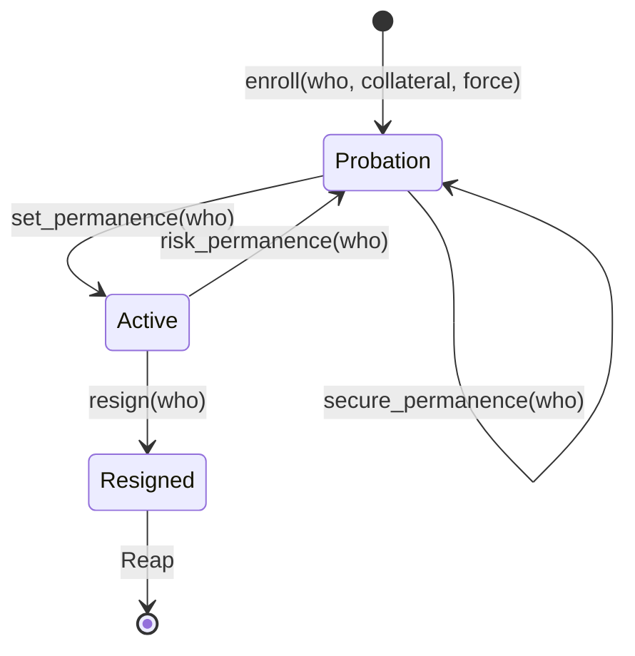
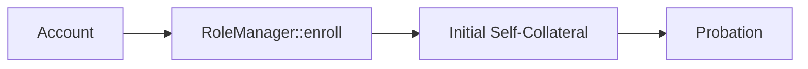
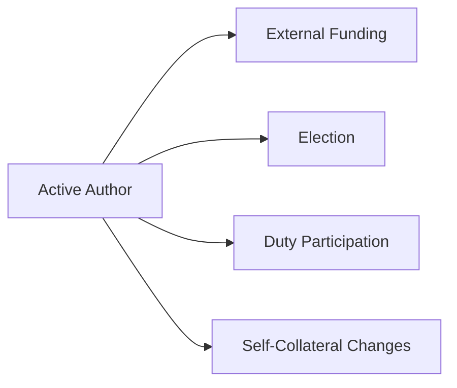
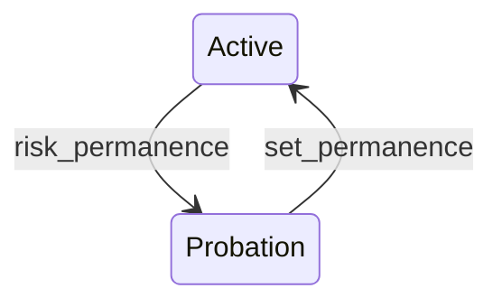
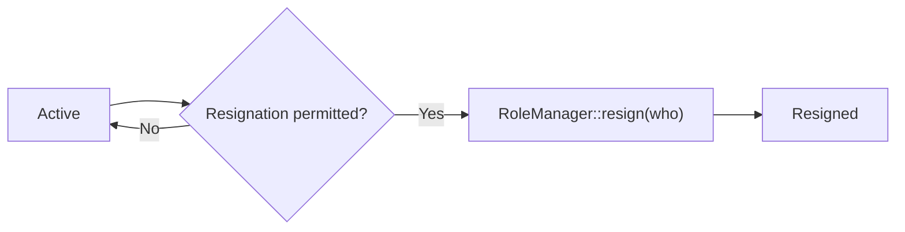
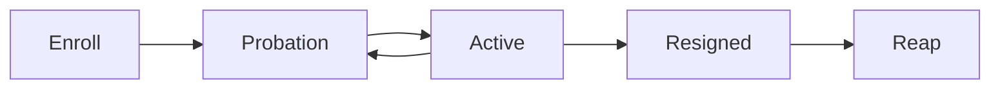

# 🔄 Lifecycle

The lifecycle architecture defines **how an Author's role state progresses from creation to eventual removal**.

It is deliberately narrower than the other architecture components. It does not define funding, elections, or duties themselves; it defines the lifecycle boundaries within which those systems operate.




## 🌱 Enrollment

An account enters the role voluntarily through:

```text
RoleManager::enroll(who, collateral, ..)
```

Enrollment establishes the Author together with its initial **self-collateral** (satisfying the configured `>= MinCollateral`).

The lifecycle therefore begins with an economic commitment rather than merely registering an account:



The commitment itself is established through the configured commitment adapter; the lifecycle layer records the resulting role state.

---

## 🟡 Probation

Every newly enrolled Author begins in `Probation`.

Probation provides the lifecycle with a period in which the Author's suitability can be established before it receives permanent standing.

The relevant boundary for duty pallets is:

```text
RoleProbation::set_permanence(who)
```

Once the required conditions are satisfied, the Author progresses to `Active`.

The probation period is governed by runtime configuration and can be adjusted as the protocol's requirements change.

---

## 🟢 Active Standing

`Active` represents an Author that has established sufficient standing to participate in the wider role system.

At this point the Author may become relevant to the rest of the architecture:



These systems do not change the meaning of `Active`; they operate **around an Author that has reached Active standing**.

---

## ⚠️ Risk and Re-Probation

Active standing is not permanent immunity from risk.

When the Author's continued suitability becomes uncertain, the lifecycle can introduce risk through:

```text
RoleProbation::risk_permanence(who)
```

which brings the Author back under probation.



While under probation, risk can be increased or reduced. Resolving risk can shorten the remaining probation period, while additional risk can extend it.

This makes the lifecycle **reversible**:

> An Author can earn Active standing, lose it through risk, and subsequently establish it again.

---

## 🔒 Leaving the Role

An Author leaves voluntarily through:

```text
RoleManager::resign(who)
```

Resignation is only available from `Active` standing.

There is an additional runtime-level consideration: a duty pallet may have an Author currently committed to an assigned duty. In such a case, the duty may prevent resignation until the required duty has been completed or released.

Thus resignation represents a **voluntary lifecycle transition**, while duty completion determines whether that transition is currently permitted.



---

## 🧹 Resigned State

`Resigned` is currently a **terminal role state**, but it is not equivalent to removing the Author's on-chain representation.

The Author's metadata is intentionally retained after resignation because external funding relationships may still depend on the Author. Funders must remain capable of resolving and withdrawing their positions even after the Author has left the role. 

The Author's digest mapping is retained as well. Since indexes and pools may continue to reference an `AuthorDigest`, removing the mapping could make those commitments impossible to resolve safely. 

Thus, **resignation currently ends the role's active lifecycle without reaping its stored identity and economic references**.

> **`Resigned` means the Author no longer participates as an active role; it does not currently mean that its storage representation is deleted.**

---

## 🔁 Lifecycle Boundary

The complete lifecycle is therefore intentionally small:



The key architectural distinction is:

> **Lifecycle determines whether an account is entering, maintaining, losing, or leaving the role. Other architecture components determine what the role does while it exists.**
