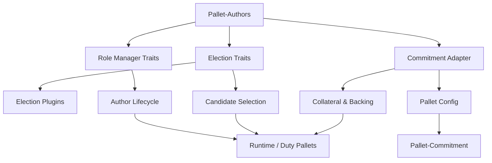
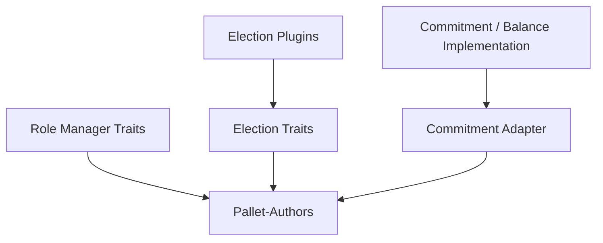

# 🏗️ Overview

Pallet-Authors is built around **three core primitives**. Everything above them—Author lifecycle, funding, elections, duties, and runtime integration—is composed from these abstractions.

The three primitives are:

1. **Role Manager Traits**
2. **Election Traits**
3. **Commitment Adapter**

Election and commitment behavior can then be specialized through their respective plugins and implementations.



## 🧩 Role Manager Traits

The **Role Manager** is the primitive responsible for abstracting the lifecycle of a role.

Pallet-Authors implements the role as an **Author**, but the lifecycle operations are expressed through traits rather than being tightly coupled to individual callers.

Conceptually, the role manager owns operations such as:

```text
enroll
-> probation
-> active
-> resigned
```

It also provides the mechanisms through which external duty pallets can influence the role's standing, such as moving an Author between **Active** and **Probation**.

This creates the first architectural boundary:

> **Role management determines who holds the role and what state that role is in.**

The role manager does not need to know how an election is performed or how collateral is represented.

---

## 🗳️ Election Traits

The **Election Traits** abstract the process of selecting Authors from eligible candidates.

Rather than embedding a particular election algorithm into the pallet, Pallet-Authors exposes election abstractions that can be implemented through plugins.

The architecture separates the election representation from the selection algorithm.

```text
Author Economic Position
          │
          ├───────────────┐
          │               │
        Flat             Fair
          │               │
    Influence        Individual
      Model          Backing
          │               │
          └───────┬───────┘
                  ↓
          Election Model
                  ↓
          Selected Authors
```

For Flat elections, an **Influence Model** transforms the Author's economic position into an influence value before the Flat Election Model operates on it.

For Fair elections, the individual backing structure is passed to the Fair Election Model without that compression step.

The traits therefore allow the election mechanism to remain independent of the Author lifecycle and funding implementation.

---

## 🔐 Commitment Adapter

The **Commitment Adapter** is the bridge between Pallet-Authors and the commitment infrastructure.

Pallet-Authors needs commitment operations for things such as:

* Self-collateral
* External backing
* Increasing backing
* Rewards & Penalties
* Releasing commitments

But it does not need to own the underlying accounting implementation.

Instead, the pallet's configuration provides the implementation of the required commitment traits. In the intended configuration, **`pallet-commitment`** is plugged in through the pallet configuration and supplies those implementations.

```text
-> Pallet-Authors
-> Config
-> Commitment Traits
-> pallet-commitment
-> Balance / Accounting Model
```

This is an important architectural boundary.

Pallet-Authors understands **that an economic commitment exists and how the Author role uses it**.

The commitment system determines **how that commitment is represented, accounted for, resolved, and released**.

---

## 🔌 Plugins

The primitives deliberately leave certain decisions open.

The **Election Traits** allow election behavior to be supplied through:

* Influence Models
* Flat Election Models
* Fair Election Models

The **Commitment Adapter** allows the underlying commitment implementation and its balance/accounting model to be supplied externally.

This gives the pallet a structure closer to:



The pallet therefore does not need to encode every possible economic or electoral policy.

---

## 🧱 Composition

The higher-level functionality of Pallet-Authors is built by composing these primitives.

```text
                    Pallet-Authors
                         │
        ┌────────────────┼────────────────┐
        │                │                │
        ▼                ▼                ▼
 Role Manager       Election Traits   Commitment Adapter
        │                │                │
        │          ┌─────┴─────┐          │
        │          │           │          │
        │        Flat        Fair         │
        │          │           │          │
        │       Plugins     Plugins       │
        │                               Config
        │                                 │
        │                          pallet-commitment
        │
        └──────────────┬──────────────────┘
                       ▼
                 Author System
```

This composition means that the pallet's core role-management logic does not have to change when:

* A different election algorithm is required.
* A different influence calculation is required.
* A different fair-election strategy is required.
* A different commitment implementation is configured.
* A different balance/accounting model is introduced underneath the commitment system.

> **The architecture separates role semantics, election semantics, and economic commitment semantics into independent Rust abstractions. Pallet-Authors composes them into a concrete Author system.**
