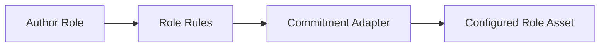
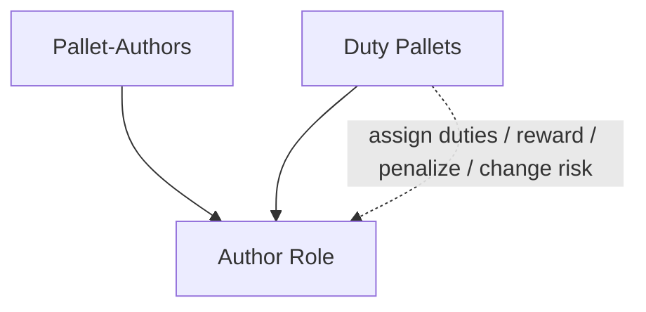
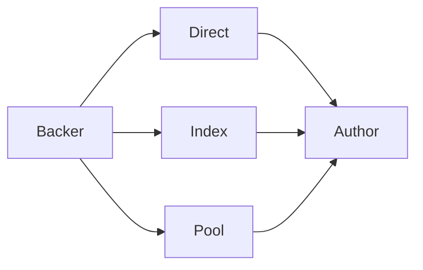
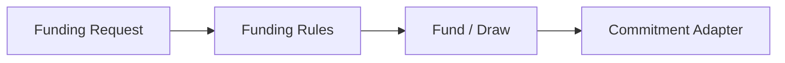
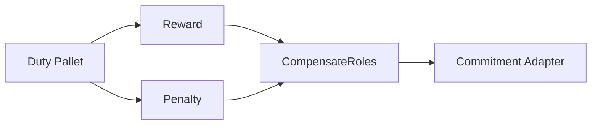
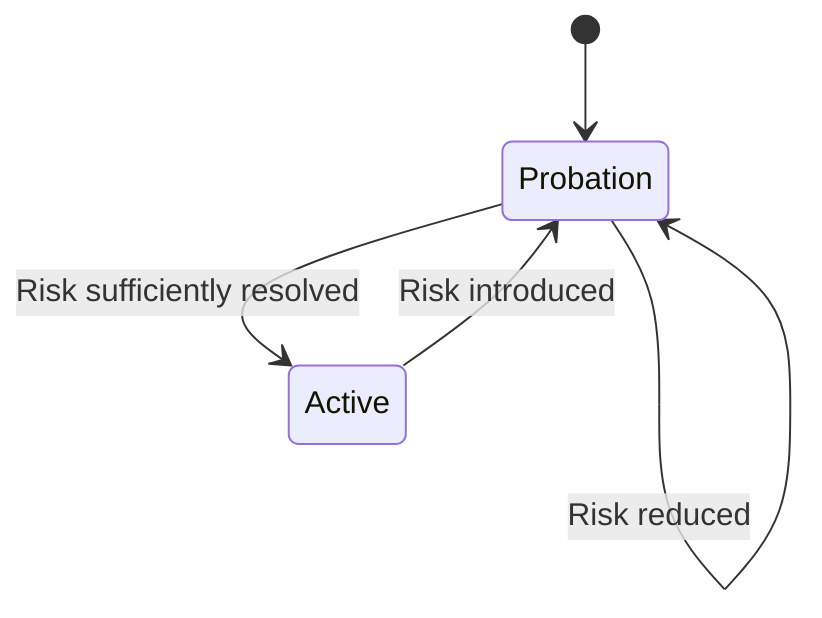
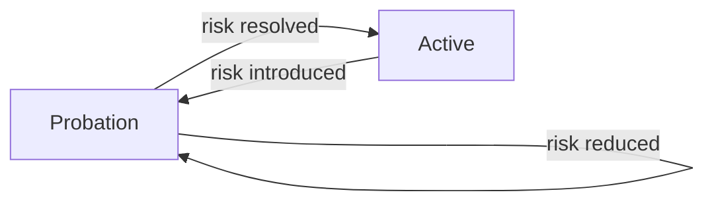
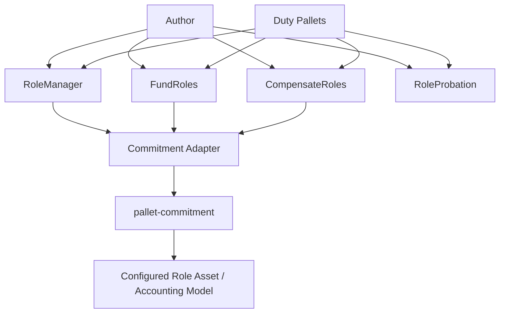

# 🧑‍⚖️ Role-Manager

Pallet-Authors implements the generalized **role system** from `frame_suite::roles` through defining the `Author` role.

The role architecture is divided into four main traits, each responsible for a different dimension of the role:

```text
                     Author
                        │
        ┌───────────────┼────────────────┐
        │               │                │
   RoleManager      FundRoles      CompensateRoles
        │               │                │
        └───────────────┼────────────────┘
                        │
                 RoleProbation
```

These traits are implemented by Pallet-Authors, while the underlying economic operations are delegated to the configured **Commitment Adapter**.

---

## 🧩 Role Manager

The `RoleManager` trait is the foundation of the Author role.

It manages the Author's identity, lifecycle, metadata, and self-collateral. The role manager is also the primary interface through which other runtime pallets determine whether an account is a valid and available Author.

The `RoleManager` is the primary boundary between the generalized role system and the Author implementation.

Its responsibility is to answer a fundamental set of questions:

> **Does this account hold the role, what state is the role in, what economic commitment does it carry, and can that role currently participate or leave?**

The main lifecycle operations are:

| Operation | Role in the architecture |
| ----------| -------------------------|
| `enroll(who, collateral)`| Introduces an account into the Author role together with its initial self-collateral. |
| `resign(who)`| Allows an eligible Author to voluntarily leave and resolve its own collateral.|
| `add_collateral(who, collateral)`| Strengthens the Author's own economic commitment. |
| `is_available(who)` | Provides consuming pallets with a single check for whether the Author is currently fit to participate in duties. |
| `get_status(who)`| Allows other pallets to determine whether the Author is in `Probation`, `Active`, or `Resigned`. |

Other operations expose querying of additional role state without requiring external pallets to depend on Pallet-Authors' internal storage representation.

### 🌱 Entering the Role

Enrollment is where an account becomes an Author.

```text
Account
   │
   │ voluntary enrollment
   │ + initial collateral
   ▼
Author
   │
   ▼
Probation
```

The important point is that enrollment establishes **both identity and economic commitment**.

The collateral is not a separate balance maintained by the role manager. It is established through the configured commitment system. The role layer therefore expresses *that an Author has an economic commitment*, while the commitment layer determines how that commitment is represented and managed.

Because the Author role is voluntary and enrollment is open, a newly enrolled participant is not automatically treated as permanently trusted. The probation machinery (via `RoleProbation` trait) provides the initial period in which the participant's suitability can be established.

### 🚪 Leaving the Role

Resignation is the other major lifecycle boundary.

An Author can request:

```text
resign(who)
```

but the role manager first determines whether the Author is actually allowed to leave.

This is important because **being an Author and being free to leave are different concepts**.

For example, an Author may still be associated with an active duty. A duty pallet can therefore prevent resignation until that duty has been released.

Once resignation is permitted, the Author's **own collateral** can be resolved.

External backing is intentionally outside this operation. A backer's position belongs to the funding relationship and is therefore handled by `FundRoles` and the commitment system.

### 💰 Self-Collateral

The role manager also provides the Author's own economic commitment.

An Author can increase that commitment through:

```text
add_collateral(who, collateral, force)
```

The role manager establishes the role-level rules around this operation, while the configured commitment adapter performs the underlying economic operation.

This gives the architecture a clean separation:



The Author architecture therefore does not need to know whether the underlying asset uses a particular balance representation.

### 🔎 Role State

The role manager exposes the state required by other parts of the runtime.

An external pallet can conceptually ask:

```text
-> Does this account have the role?
-> What is its status?
-> What collateral does it have?
-> Is it currently available?
```

For example:

```text
is_available(who)
```

represents a higher-level role decision rather than merely checking whether an account exists.

An account may still exist as an Author while being unsuitable for participation because it is under probation, resigned, restricted by an active duty, or does not satisfy the required collateral conditions.

This makes the role interface more useful to consuming pallets than exposing raw storage directly.

### 🏛️ Why This Boundary Matters

The **Role Manager does not manage the duties of an Author**.

A block-production pallet, election pallet, oracle pallet, or another runtime component may decide what Authors are required to do. Pallet-Authors only provides the role machinery those pallets depend on.

The relationship is therefore intentionally one-directional:



The duty pallet **consumes the role** rather than becoming part of its implementation.

That is the deeper purpose of `RoleManager`: it gives the runtime a stable abstraction for **managing an economically-backed role without coupling that role to any particular duty**.

> **`RoleManager` defines the life of the Author. Other pallets define what an Author does with that life.**

---

## 💰 Fund Roles

The `FundRoles` trait manages the relationship between an Author and its **external backers**.

While `RoleManager` is concerned with the Author's **own collateral**, `FundRoles` represents the economic support provided by others.

External backing can reach an Author through the funding mechanisms supported by the commitment layer (via `pallet-commitment` primarily):



The important architectural point is that these are different **ways of organizing the same fundamental relationship**:

> **A participant places its own economic resources behind an Author.**

The role layer does not need to understand how each funding mechanism internally stores or accounts for that support. `FundRoles` provides the role-level interface, while the configured `CommitmentAdapter` handles the underlying commitment.

### 🔗 The Backing Relationship

Backing is deliberately separate from the Author's self-collateral.

```text
Author
 ├── Self-collateral
 │      └── owned by the Author
 │
 └── External backing
        ├── Backer A
        ├── Backer B
        └── Backer C
```

This distinction matters because external participants are economically committing themselves to the Author. Their positions can therefore participate in the consequences associated with the Author's duties without becoming the Author itself.

The same separation also allows an individual backer to leave its position independently of the Author's own collateral.

### 🔑 Core Operations

| Operation | Role in the architecture |
| ----------| -------------------------|
| `fund(author, backer, amount)` | Establishes or increases external backing for an Author.|
| `draw(author, backer, amount)` |Removes an external backing position when permitted. |
| `backed_value(author)`| Determines the external backing associated with an Author. |
| `backers_of(author)`| Provides the participants and their economic positions currently backing an Author. |
| `backed_for(backer)`| Provides the Author/s supported by a particular backer. |
| `get_fund(author, backer)`| Inspects the backing position between a particular Author and backer. |

The exact economic behavior of these operations is intentionally not embedded in `FundRoles`.

### 🔐 Validation Before Funding

Operations that change a backing position are subject to role and commitment rules before they take effect.

For example:

```text
can_fund(who, backer, ...)
can_draw(who, backer, ...)
```

are used to determine whether the requested operation is permitted.

This keeps validation separate from the actual state transition:



This is particularly important for `draw`, because external backing may have accumulated rewards, penalties, or other commitment state while supporting an Author.

### 🔌 Commitment Adapter

`FundRoles` does not become an accounting implementation.

Instead, the funding operation eventually reaches the configured commitment system:

```text
FundRoles
    │
    ▼
Commitment Adapter
    │
    ▼
pallet-commitment
    │
    ├── Balance / accounting plugin
    ├── Commitment rules
    └── Resolution
```

The asset used for external backing is therefore determined by the runtime's **commitment configuration**.

This preserves the separation between:

* **Who is being backed** — the Author role.
* **Who is providing the support** — the external backer.
* **How support is organized** — direct, index, or pool.
* **How the economic commitment is represented** — the configured commitment implementation.

> **`FundRoles` defines the relationship between Authors and their supporters; the Commitment Adapter defines how that relationship becomes an economic commitment.**


---

## 🎁 Compensation

The `CompensateRoles` trait represents the **economic consequences of an Author's participation in runtime duties**.

A **duty pallet** can use this interface to reward or penalize an Author without directly manipulating its collateral or backing positions.



This is important because the duty pallet determines **what happened**, while the compensation layer determines how that outcome becomes an economic consequence.

For example, a duty pallet may determine that an Author successfully performed an assigned duty and issue a reward. Conversely, failure or misconduct may result in a penalty.

### 🔑 Core Operations

| Operation | Role in the architecture |
| ----------| -------------------------| 
| `reward(who, amount, ...)` | Creates a positive economic consequence for the Author.|
| `penalize(who, amount, ...)`| Creates a negative economic consequence for the Author. |
| `forgive(who, ...)` | Removes or reduces an applicable unresolved penalty. |
| `reclaim(who, ...)` | Resolves an outstanding economic obligation when permitted.|
| `get_hold(who)` | Inspects the economic position currently held against the Author. |

The exact arguments can vary with the configured commitment implementation; the important architectural boundary is that the **role layer expresses the consequence**, while the commitment layer provides the accounting mechanism.

### ⚖️ Rewards and Penalties

Compensation is not limited to the Author's own collateral.

An Author can have multiple economic positions:

```text
Author
 ├── Self-collateral
 └── External backing
       ├── Backer A
       ├── Backer B
       └── Backer C
```

When a duty pallet produces a reward or penalty, the configured commitment model determines how that consequence propagates through the relevant economic positions.

This allows the same underlying commitment structure to account for:

* Author self-risk
* External backing
* Rewards
* Penalties
* Unresolved economic obligations

The consequence can therefore remain attached to the commitment rather than being treated as an unrelated balance transfer.

> **The duty pallet decides the consequence. `CompensateRoles` expresses it against the Author. `pallet-commitment` determines how that consequence is economically represented and resolved.**


---

## ⚠️ Role Probation

The `RoleProbation` trait manages the **risk and permanence** of the Author role.

Probation is not simply an enrollment waiting period. It is the mechanism through which the role system determines whether an Author has earned, or continues to deserve, the ability to participate as an **Active** role.

A newly enrolled Author begins under Probation. During this period, its ability to participate is more restricted while the system evaluates its continued suitability.

An already Active Author can also be returned to Probation when a duty pallet or another authorized part of the runtime introduces sufficient risk.



### ⏳ Risk as a Time Period

Probation is represented through a **risk period**, rather than simply a boolean flag.

The configured governance parameters determine the normal probation period, while the accumulated risk determines how much of that period remains.

This allows the period to move in both directions:

```text
More risk
-> Longer probation
-> Less immediate permanence

Less risk
-> Shorter remaining probation
-> Closer to Active
```

An Author that behaves appropriately during Probation can progressively reduce its remaining risk. Conversely, additional risk can extend the period or prevent the Author from becoming Active.

Governance can configure the underlying probation parameters, allowing the protocol to determine how conservative the transition into Active standing should be.

### 🔑 Core Operations

| Operation |  Role in the architecture |
| ----------| ------------------------ | 
| `set_permanence(who)`| Moves an eligible Author from Probation to Active. |
| `revoke_permanence(who)` | Moves an Active Author back into Probation when sufficient risk exists.|
| `risk_probation(who, ...)` | Increases or extends risk against an Author under Probation. |
| `risk_permanence(who, ...)` | Introduces risk against an Author that is already Active. |
| `secure_permanence(who, ...)`| Reduces outstanding risk as the Author establishes continued suitability.|

The exact risk information supplied to these operations is part of the role implementation; the architectural purpose is to allow risk to **accumulate and resolve over time**.

### 🔄 Active Does Not Mean Permanent

Becoming Active is therefore not an irreversible promotion.

An Active Author has demonstrated sufficient suitability, but its position can become risky again.

For example, a duty pallet may determine that an Author failed to perform an assigned duty and introduce risk through:

```text
risk_permanence(who, ...)
```

The Author can then return to Probation rather than being immediately removed from the role.

Likewise, successful continued participation can reduce the outstanding risk through:

```text
secure_permanence(who, ...)
```

This gives the role system a continuous accountability cycle:



The important distinction is that **risk reduction does not itself represent a new role**. It reduces the conditions preventing permanence.

> **Probation makes the Author's standing conditional: suitability must be established before becoming Active and continuously maintained afterward.**


---

## 🔗 How the Role Traits Connect

Although these traits have separate responsibilities, they operate on the same Author and form a single role system.

| Trait             | Owns                                          |
| ----------------- | --------------------------------------------- |
| `RoleManager`     | Identity, lifecycle, status, self-collateral  |
| `FundRoles`       | External backing                              |
| `CompensateRoles` | Rewards, penalties, and economic consequences |
| `RoleProbation`   | Risk, probation, and permanence               |

The economic traits ultimately converge on the **Commitment Adapter**:



The `RoleProbation` layer primarily controls role state, while `RoleManager`, `FundRoles`, and `CompensateRoles` use the commitment infrastructure whenever an economic position must be changed.

---

## 🔌 Runtime Integration

The role traits are also the main boundary between **Pallet-Authors** and the pallets that consume Authors.

A duty pallet does not need to know how Authors are stored internally. It can operate through the role interfaces to:

* Discover eligible Authors.
* Inspect their lifecycle.
* Check their collateral.
* Conduct elections.
* Assign duties.
* Prevent resignation while duties are active.
* Reward or penalize participation.
* Increase or reduce risk.
* Return an Author to Probation when necessary.

This separation is deliberate:

> **Pallet-Authors manages the role; duty pallets decide what the role must do.**

The result is that the Author role remains reusable across different runtime duties while its economic and lifecycle semantics stay centralized in Pallet-Authors.
