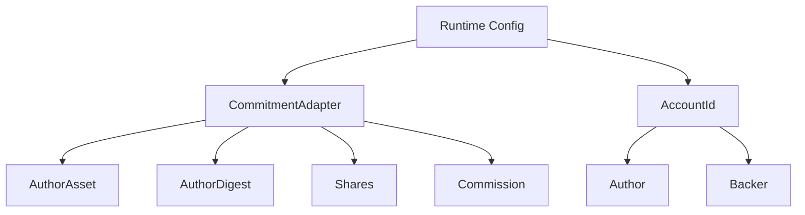
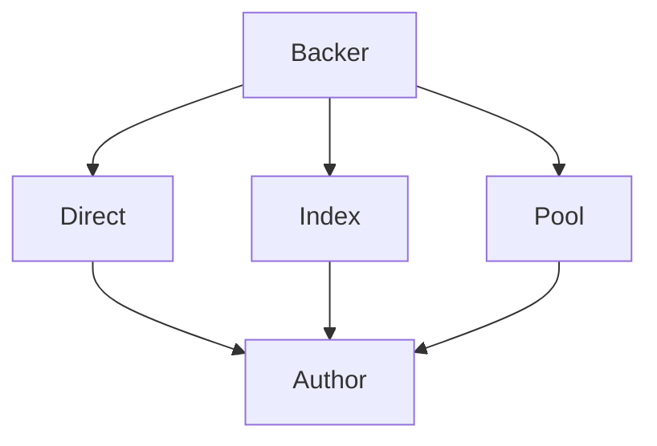
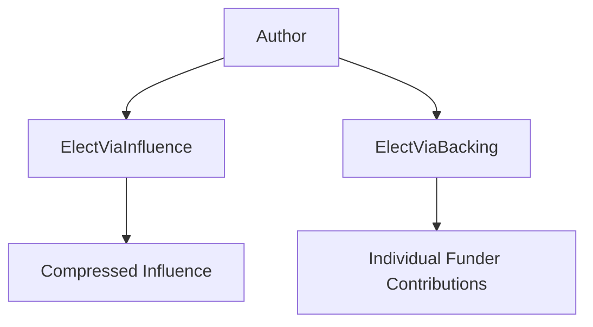
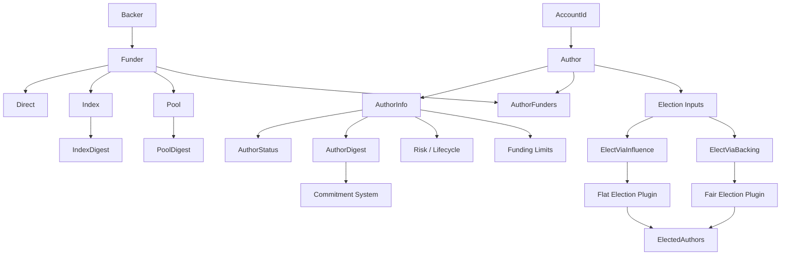
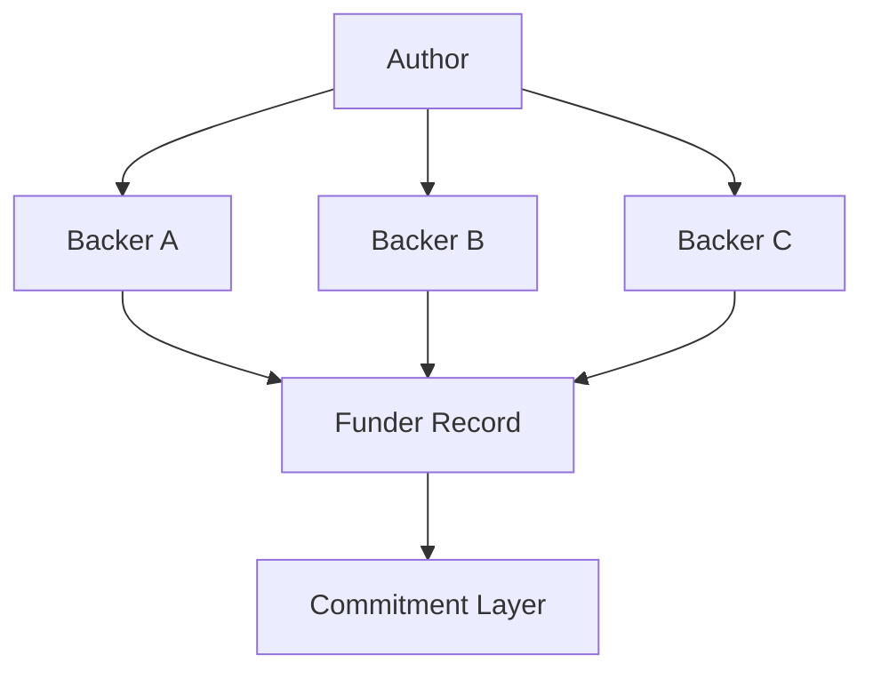
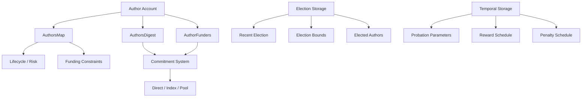

# 🗄️ Storage & Types

The storage and type layer is where Pallet-Authors gives the generalized role system a **concrete representation for the Author role**.

The important distinction is between:

* **Role state** - owned and stored by Pallet-Authors.
* **Economic state** - represented through the configured `CommitmentAdapter`.
* **Election state** - represented by the election-specific types and stored results.
* **Funding relationships** - represented by Author-level records that point into the commitment system.

The types are also deliberately derived from the runtime's configured traits wherever possible, so Pallet-Authors does not impose its own asset, digest, share, or commission representations. 

---

## 🧩 Fundamental Type Layer

At the bottom are the aliases that connect the Author role to the runtime and the other architectural components.

| Type              | Meaning                                                                                     |
| ----------------- | ------------------------------------------------------------------------------------------- |
| `Author`       | The runtime `AccountId` that holds the Author role.                                         |
| `AuthorAsset`  | The asset type exposed by the configured `CommitmentAdapter`.                               |
| `AuthorDigest` | The commitment digest identifying the Author's economic commitment.                         |
| `Backer`       | The account providing external backing.                                                     |
| `IndexDigest`  | Digest identifying an index-based commitment.                                               |
| `PoolDigest`   | Digest identifying a pool-based commitment.                                                 |
| `Shares`       | Share type supplied by the commitment index implementation.                                 |
| `Commission`   | Commission type supplied by the commitment pool implementation.                             |
| `Ratio`        | Ratio used by the compensation implementation for penalties or related economic operations. |

For example, `AuthorAsset` is derived directly from `CommitmentAdapter::InspectAsset`, while `Shares` and `Commission` come from the corresponding commitment capabilities. 

This makes the dependency explicit:



So, for example, Pallet-Authors does not decide whether its economic asset is `u64`, `Balance`, or some custom type. The commitment configuration decides that.

---

## 👤 Author Info

`AuthorInfo` is the central **role-state structure**.

It represents the state of an Author independently of the account that identifies it and independently of the underlying commitment accounting.

Its current structure is:

```rust
pub struct AuthorInfo {
    pub digest: AuthorDigest,
    pub since: BlockNumber,
    pub status: AuthorStatus,
    pub status_since: BlockNumber,
    pub risk_until: BlockNumberFor,
    pub min_fund: Option<AuthorAsset>,
    pub max_fund: Option<AuthorAsset>,
}
```


| Field          | Architectural meaning                                 |
| -------------- | ----------------------------------------------------- |
| `digest`       | Connects the role to its economic commitment.         |
| `since`        | Records when the Author entered the role.             |
| `status`       | Records the Author's lifecycle state.                 |
| `status_since` | Records when the current lifecycle state began.       |
| `risk_until`   | Defines the current risk horizon for the Author.      |
| `min_fund`     | Optional Author-specific minimum funding requirement. |
| `max_fund`     | Optional Author-specific maximum funding exposure.    |

The important architectural property is that `AuthorInfo` does **not contain the actual collateral balance**.

Instead:

```text
AuthorInfo
    │
    └── digest
          │
          ▼
    Commitment System
          │
          └── Economic Position
```

The structure therefore describes **what the Author is and what state it is in**, while the commitment system describes **what economic resources are committed to it**.

`AuthorInfo` is also the metadata type exposed through the role abstraction, allowing `RoleManager` to use `AuthorInfo` as the concrete role metadata. 

### ⏱️ Temporal Types

Time is represented using the runtime's `BlockNumber` rather than a pallet-specific integer.

This appears throughout the role structures:

```rust
since: BlockNumber,
status_since: BlockNumber,
risk_until: BlockNumber,
```

This makes lifecycle state inherently tied to the runtime's block progression.

The same temporal type is used for:

* Probation periods
* Risk periods
* Reward buffers
* Penalty buffers
* Reward scheduling
* Penalty scheduling
* Election recency

For example, `RewardsUntil` and `PenaltiesUntil` track the latest block through which scheduled economic consequences exist, allowing the pallet to process them efficiently. 


## 🔄 Author Status

The lifecycle is represented by `AuthorStatus`:

```rust
pub enum AuthorStatus {
    Active,
    Probation,
    Resigned,
}
```

The absence of a `Suspended` state is intentional.

The status therefore represents **role standing**, not temporary operational restrictions.

For example, an Author can remain `Active` while a duty pallet controls whether it is currently assigned to a duty. Likewise, an Author can be placed back into `Probation` when its standing becomes risky.

This keeps the lifecycle representation independent from individual runtime duties.

---

## 🤝 Funder

External backing is represented through the `Funder` enum.

```rust
pub enum Funder {
    Direct(Backer),

    Index {
        digest: IndexDigest,
        backer: Backer,
    },

    Pool {
        digest: PoolDigest,
        backer: Backer,
    },
}
```


This is important because **a backer is not necessarily the direct owner of the commitment that reaches the Author**.

There are three possibilities:

| Variant  | Meaning                                                                    |
| -------- | -------------------------------------------------------------------------- |
| `Direct` | The backer directly commits resources to the Author.                       |
| `Index`  | The backer participates through an index identified by `IndexDigest`.      |
| `Pool`   | The backer participates through a managed pool identified by `PoolDigest`. |

Conceptually:



The enum therefore captures the **origin and route of backing**, while the commitment layer handles the actual economic position.

---

## 🎯 Funding Target

`FundingTarget` represents where a funding operation is directed.

```rust
pub enum FundingTarget {
    Direct(Author),
    Index(IndexDigest),
    Pool(PoolDigest),
}
```

This is subtly different from `Funder`.

`Funder` answers:

> **Who is providing the backing and through what mechanism?**

`FundingTarget` answers:

> **Where is the commitment being directed?**

That distinction becomes important for index and pool funding, where the account performing the operation and the commitment receiving the operation are not necessarily the same entity.

---

## 🔐 Commitment Digest Types

The commitment layer introduces digest-based identity into the Author architecture.

```rust
pub type AuthorDigest = <Config::CommitmentAdapter as Commitment>::Digest;
```

`IndexDigest` and `PoolDigest` are similarly derived from the configured commitment implementation.  

This gives the architecture:

```text
Account
   │
   ▼
Author
   │
   ├── Role identity
   │
   └── AuthorDigest
          │
          ▼
     Commitment
          │
          ├── Self-collateral
          ├── Direct backing
          ├── Index backing
          └── Pool backing
```

The digest is therefore the bridge between the **role abstraction** and the **economic abstraction**.

---

## 🗳️ Election Types

The election architecture also has dedicated input and output types.

### `ElectedAuthors`

```rust
pub type ElectedAuthors = Vec<Author>;
```

This represents the final set of Authors selected by an election round. 

### `ElectViaInfluence`

```rust
pub type ElectViaInfluence = Vec<(Author, Vec<Config::Influence>)>;
```

This is the input used by the Flat election path.

An Author is accompanied by its influence values rather than its individual funding relationships. 

### `BackingElectionWeight`

```rust
pub type BackingElectionWeight = (Funder, AuthorAsset);
```

This represents one individual backing contribution supplied to a Fair election. 

### `ElectViaBacking`

```rust
pub type ElectViaBacking = Vec<(Author, Vec<BackingElectionWeight>)>;
```

This preserves the individual backing structure for Fair election models. 

The two representations therefore make the architectural distinction explicit:



## 🧠 Type Architecture

Putting the structures together:



The overall design can be summarized as:

| Layer | Main types | Responsibility |
| ------| -----------| ---------------|
| **Identity** | `Author`, `Backer` | Identify participants. |
| **Role state** | `AuthorInfo`, `AuthorStatus` | Represent lifecycle and standing. |
| **Economics** | `AuthorDigest`, `IndexDigest`, `PoolDigest`, `AuthorAsset` | Connect role state to commitments.|
| **Funding**  | `Funder`, `FundingTarget` | Represent how backing reaches an Author. |
| **Elections**  | `ElectViaInfluence`, `ElectViaBacking`, `BackingElectionWeight`, `ElectedAuthors` | Represent election inputs and results. |
| **Time**  | `BlockNumber` | Represent lifecycle and scheduled economic events.|

The key architectural boundary remains:

> **The types in Pallet-Authors describe the Author role and its relationships. They do not become an alternative accounting system. Economic values, commitment digests, shares, and commissions are derived from the configured commitment layer.**

This is what lets the same role architecture remain valid even when the runtime changes the underlying economic model. 


---

## 🗂️ Author Storage

The primary storage is `AuthorsMap`:

```rust
AuthorsMap: StorageMap<Author, AuthorInfo>
```

It maps an Author account to its role metadata and is the primary record used throughout the pallet. It contains lifecycle state, risk information, timestamps, and Author-specific funding constraints. 

An important architectural decision is that **Author records are not simply deleted when an Author resigns**.

The metadata remains available because external commitments may still reference the Author. A resigned Author can therefore remain discoverable while its funders resolve their outstanding positions. 

### 🔑 Digest Resolution

The reverse mapping is maintained by `AuthorsDigest`:

```rust
AuthorsDigest: StorageMap<AuthorDigest, Author>
```

This provides:

```text
Author
   │
   ▼
AuthorDigest ──────────► Author
```

The digest mapping is intentionally persistent. Indexes, pools, or other commitment structures may retain an Author digest even after the Author resigns, so the runtime must still be able to resolve that digest back to the Author. 

This is particularly important for the commitment architecture: **the digest is an economic reference that can outlive the Author's active role state**.

---

## 🤝 Funding Storage

External funding has its own relationship storage:

```rust
AuthorFunders: StorageNMap<(Author, Backer), Funder>
```

This represents the relationship between a particular Author and a particular backer. It supports the three funding paths exposed by the pallet:

* Direct backing
* Index-backed positions
* Pool-backed positions

Conceptually:



The storage therefore records the **role-level relationship**, while the commitment system remains responsible for the underlying economic position.

---

## ⏱️ Temporal Storages

Several storage values exist to represent system-wide temporal behavior rather than individual Author state.

| Storage               | Purpose                                                                |
| --------------------- | ---------------------------------------------------------------------- |
| `ProbationPeriod`     | Default probation duration.                                            |
| `ReduceProbationBy`   | Amount by which probation can be reduced as risk is resolved.          |
| `IncreaseProbationBy` | Amount by which probation can be extended when additional risk occurs. |
| `RewardsBuffer`       | Delay before rewards become applicable.                                |
| `PenaltiesBuffer`     | Delay before penalties become applicable.                              |
| `RewardsUntil`        | Latest block through which rewards are scheduled.                      |
| `PenaltiesUntil`      | Latest block through which penalties are scheduled.                    |

These values are **governance-controlled runtime parameters** and can be actively updated as the protocol's requirements change. Governance can therefore adjust probation behavior, risk progression, and the timing of rewards and penalties without changing the underlying role implementation.

The reward and penalty boundary values allow the pallet to process scheduled obligations without repeatedly scanning irrelevant blocks.

---

## 🗳️ Election Storage

Election configuration and state are also persisted by the pallet.

| Storage           | Purpose                                                         |
| ----------------- | --------------------------------------------------------------- |
| `RecentElectedOn` | Block at which the latest successful election was stored.       |
| `MinElected`      | Minimum number of Authors required for a valid election.        |
| `MaxElected`      | Maximum number of Authors that may be elected.                  |
| `ForceMaxElected` | Whether results exceeding the maximum are forcefully truncated. |
| `Elected`         | The stored election result for the election round.              |

The election parameters are also **actively configurable by governance**. This allows governance to change the required election size and the constraints applied to election results as the runtime's operational requirements evolve.

`RecentElectedOn` acts as a lightweight reference to the latest election without requiring historical election records to be scanned.

Importantly, these governance-controlled constraints remain **independent of the selected election plugin**. Whether the runtime uses a Flat or Fair election model, the resulting election is still subject to the configured `MinElected`, `MaxElected`, and `ForceMaxElected` rules.

## 🧠 Storage Architecture

The overall storage model can therefore be viewed as four connected areas:



The important separation is:

> **Pallet-Authors stores the role's identity, lifecycle, relationships, schedules, and election state; `pallet-commitment` stores and resolves the underlying economic commitments.**

This keeps the storage layer consistent with the architecture: **role state belongs to Authors, economic state belongs to Commitment, and election behavior belongs to the configured election plugins.**
