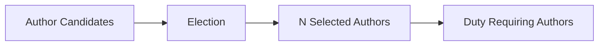

# 🧑‍💼 Author

An **Author** is a participant who voluntarily takes on a defined role within the protocol, primarily intended for **block authorship**.

The important distinction is that an Author is not simply an account. It is a **role that an account chooses to enter**, with its own responsibilities, economic commitments, privileges, and lifecycle.

> **An account identifies the actor. An Author represents the actor's role.**

## 🎯 Why a Role?

A role gives the protocol a way to separate **who someone is** from **what they are authorized and expected to do**.

An account may exist without participating as an Author. By enrolling, the account voluntarily takes on the Author role and becomes subject to the rules and economic conditions associated with it.

This also allows other runtime pallets to consume the Author role without having to manage the Author's lifecycle themselves.

## 🌐 An Open System

Author enrollment is voluntary and open to participants that satisfy the required conditions.

That openness creates an important problem: **the protocol cannot assume that every participant is honest**.

An open role system must therefore account for the possibility of:

* Bad actors voluntarily enrolling
* Authors behaving incorrectly after becoming active
* Risk propagating from an Author's actions
* Participants attempting to exploit the role for economic benefit

The role is therefore designed around **accountability rather than trust**.

## 🛡️ Economic Accountability

An Author has something at stake through its economic commitment.

Self-collateral creates an initial commitment when entering the role, while external backing can further connect the Author to other participants.

This means participation is not simply:

> *“I want to become an Author.”*

It becomes:

> *“I voluntarily take this role while accepting its responsibilities and economic consequences.”*

## 🔄 Lifecycle as Risk Management

Because enrollment is voluntary and the system is open, becoming an Author does not immediately imply unrestricted participation.

An Author begins in **Probation**, with fewer privileges. It can become **Active** after successfully passing through probation.

If risk later propagates to the Author, it can be placed back into **Probation**.

The lifecycle therefore provides a way to manage an open role without requiring the protocol to assume that every enrolled participant is trustworthy.

## 🗳️ A Group of the Same Role

Authors form a **group of participants holding the same role**.

When another runtime pallet requires a particular number of Authors to perform a duty, it can request a set of **N Authors** from this group rather than assigning those participants individually.

The Author's own risk and the support it receives from others can contribute to determining which candidates are best suited for that duty.

An election can therefore be conducted among the Author candidates:

The election provides a mechanism for selecting a suitable subset of Authors from the larger role group.

## 🤝 A Role Other Systems Can Consume

The Author role is primarily intended for block authorship, but the duties associated with the role can be consumed by other runtime pallets.

Pallet-Authors manages the **role itself**; other pallets can use that role when implementing their own protocol responsibilities.

This separation keeps role management independent from the particular duties an Author performs.

## 🧠 The Core Idea

An Author should therefore be perceived as:

> **A voluntary, economically-backed protocol role whose privileges and responsibilities evolve according to its lifecycle and risk.**

The account is the participant.

The **Author is the commitment to participate in a particular role**.

A group of Authors then provides a pool of candidates from which other runtime pallets can obtain the **N roles** they need through election.
