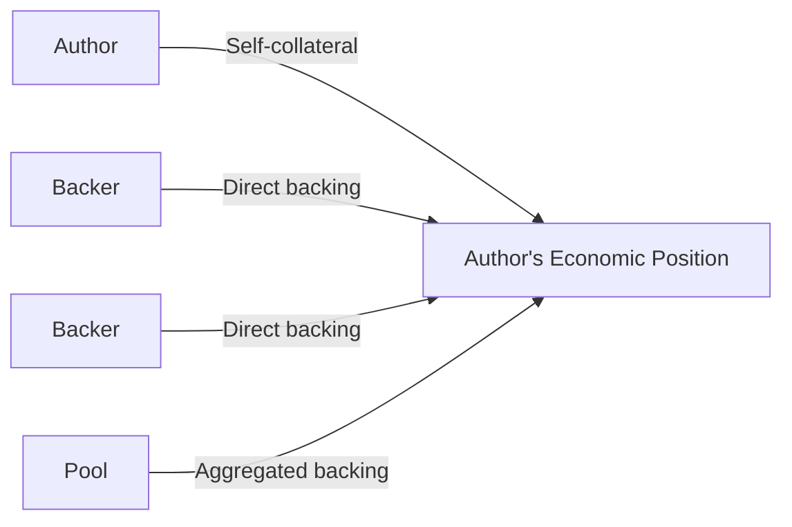

# 💰 Collateral

**Collateral** is the Author's own economic commitment to the role.

When an account voluntarily enrolls as an Author, it provides collateral as part of entering the role. This gives the Author **economic exposure to its own participation** and establishes something at stake while performing the role.

## 🔒 Self-Collateral

Self-collateral belongs to the Author's own commitment.

It is separate from support provided by other participants. An Author can increase its collateral over time when additional economic commitment is required.

## 🤝 External Support

Collateral is only one part of the Author's economic position.

Other participants can provide **external backing** to an Author. This can happen directly between a backer and an Author, or through aggregated funding mechanisms such as indexes and pools.

Self-collateral and external backing therefore represent **different relationships**, even though both contribute to the Author's economic position.

## 🏛️ Minimum Collateral

Pallet-Authors allows **governance (root) accounts** to define the minimum collateral required for an Author.

An Author must always maintain at least this minimum amount. If its collateral falls below the required minimum, the Author is considered **defaulted** and is no longer fit to perform its duties until the required collateral is restored.

This provides a protocol-level economic safety floor while allowing governance to adjust the requirement as system conditions change.

## ⚖️ Collateral and Accountability

Collateral gives the role an economic consequence.

An Author is not merely volunteering to perform a duty; it is taking on a role while committing its own resources to that participation. If the Author's collateral becomes insufficient, it can no longer satisfy the role's economic requirement.

This makes collateral part of the role's **accountability model**, rather than simply a fee for enrollment.

## 🗳️ Collateral in Elections

Collateral can also participate in the Author's election weight.

In a **Flat** election, self-collateral and external backing are compressed into a single **influence** value.

In a **Fair** election, self-collateral remains the Author's own contribution while the individual contributions of external backers are preserved.

Thus, collateral serves two purposes:

> **It commits the Author to the role and can contribute to how the Author is evaluated for selection.**
