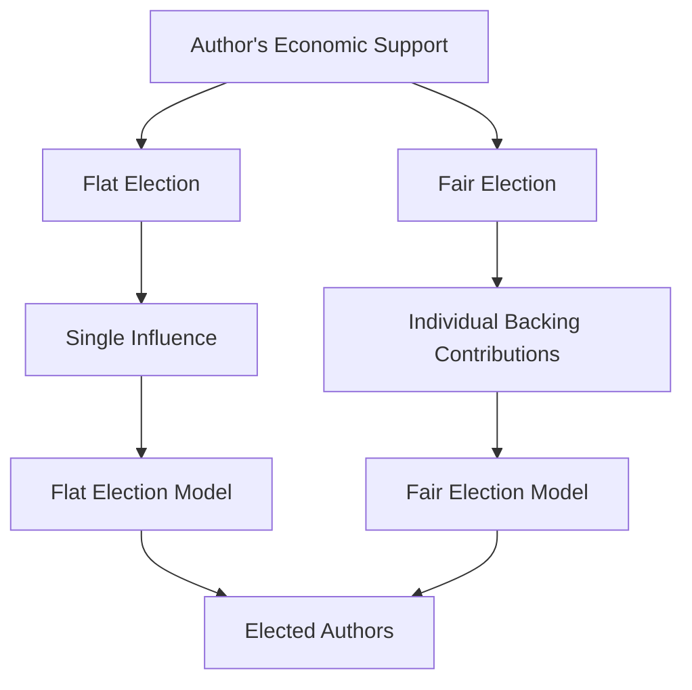
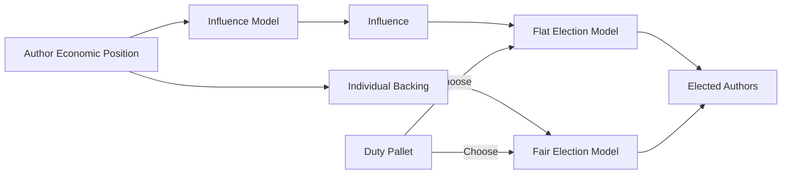
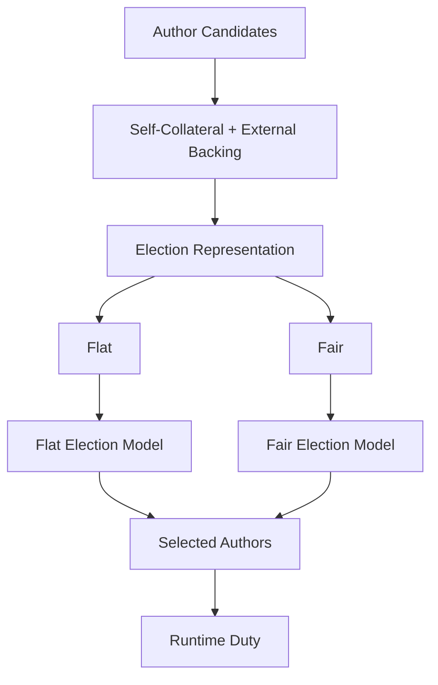

# 🗳️ Elections

**Elections** provide the mechanism for selecting a required set of Authors from the larger group of eligible Author candidates.

Pallet-Authors does not prescribe one universal interpretation of economic support. Instead, the election system is **plugin-driven**, allowing a runtime to choose how an Author's economic position should influence selection.

## 🧩 Two Election Families

The election system is divided into two fundamental families:

* **Flat Election** - represents an Author's support through a single **influence** value.
* **Fair Election** - preserves the Author's individual **backing contributions**.

These two form the fundamental boundary of the election system because an election ultimately needs to answer two questions:

1. **What representation of support should the election receive?**
2. **How should that representation be used to select Authors?**

The first question is where Flat and Fair differ.



## 📊 Flat Election

A **Flat Election** compresses an Author's economic position into a single **influence** value.

The Author's self-collateral and external backing contribute to its overall economic position. An **Influence Model** then converts that position into the influence value supplied to the election.

Conceptually:

```text
-> Economic Position
-> Influence Model
-> Influence
-> Flat Election Model
-> Elected Authors
```

The election therefore sees an Author as:

> **Author -> one comparable influence value**

The individual structure of the backing is no longer required by the election model.

### 📊 Flat Example

| Author  | Self-Collateral | External Backing | Total Support | Influence | Result      |
| ------- | --------------: | ---------------: | ------------: | --------: | ----------- |
| Alice   |             100 |               50 |           150 |       150 | 🏆 Elected  |
| Bob     |              80 |               90 |           170 |       170 | 🏆 Elected  |
| Charlie |             120 |               10 |           130 |       130 | Not elected |

The exact influence does not have to equal total support. The configured **Influence Model** determines that relationship.

For example, Alice's 150 units of support could come from:

* 100 self-collateral + 50 from one backer
* 100 self-collateral + 25 from two backers
* 100 self-collateral + 10 from five backers

If the Influence Model produces `150` in each case, the Flat election sees the same value.

> **Flat compresses the backing structure into influence.**

## 📈 Influence Models

An **Influence Model** is a plugin used **only by Flat Elections**. In simple, the compression model.

Its purpose is to determine **how an Author's economic position is converted into a single influence value** that can be supplied to the Flat Election Model.

```text
-> Author's Economic Position
-> Influence Model
-> Influence
-> Flat Election Model
```

The Influence Model therefore defines **how economic support becomes election influence**.

Different runtimes can plug in different interpretations of economic weight, such as:

* Direct proportional influence
* Diminishing influence
* Capped influence
* Threshold-based influence
* Non-linear influence
* Governance-defined weighting
* Other custom economic transformations

The important separation is:

> **Economic support does not inherently equal election influence. The Influence Model defines how that support is transformed into influence for a Flat Election.**

A **Fair Election does not use an Influence Model** because it preserves the individual backing contributions instead of first compressing them into a single influence value.


## 🏆 Flat Election Models

Once influence has been produced, the **Flat Election Model** decides which Authors should be elected.

It can implement policies such as:

* Highest-influence selection
* Ranking-based selection
* Proportional selection
* Threshold-based selection
* Quota-based selection
* Weighted selection
* Custom selection policies

Thus, the Influence Model answers:

> **“How much influence does this Author have?”**

while the Flat Election Model answers:

> **“Given these influences, which Authors should be selected?”**

---

## ⚖️ Fair Election

A **Fair Election** does not compress the Author's backing into a single influence value.

Instead, it preserves the individual contributions that make up the Author's backing.

Conceptually:

```text
-> Individual Backing
-> Backing Contributions
-> Fair Election Model
-> Elected Authors
```

The election therefore sees:

> **Author -> individual funders + their contributions**

This allows the election model to consider information that would disappear when backing is compressed into a single number.

### ⚖️ Fair Example

| Author  | Self | Backer A | Backer B | Backer C | Total Support | Election Input            |
| ------- | ---: | -------: | -------: | -------: | ------------: | ------------------------- |
| Alice   |  100 |       50 |        - |        - |           150 | Self 100, A 50            |
| Bob     |   80 |       30 |       30 |       30 |           170 | Self 80, A 30, B 30, C 30 |
| Charlie |  120 |       10 |        - |        - |           130 | Self 120, A 10            |

Bob has more total support than Alice, but the Fair election can also see **how that support is distributed**.

For example, a Fair model could distinguish between:

* One large backer
* Many independent backers
* Strong self-support
* Weak self-support with substantial external support
* Highly concentrated backing
* Broadly distributed backing

Those distinctions are intentionally preserved for the election model.

> **Fair preserves the backing structure instead of reducing it to one number.**

Add this directly after the Fair Election explanation:

## ⚖️ Fair Election Models

Because the model receives **who backs whom and by how much**, it can implement established election algorithms rather than reducing everything to a single influence score.

Examples include:

* **Phragmén-style elections** - distribute the representation burden across backing supporters to produce a balanced set of elected Authors.
* **Sequential Phragmén** - select Authors iteratively while considering how their backing contributes to the overall representation.
* **STV-style approaches** - use individual support relationships to provide proportional representation.
* **Approval-based elections** - select Authors based on which candidates individual participants support.
* **Custom proportional or fairness algorithms** - implement runtime-specific election rules.

The important point is that these models can operate on the **uncompressed backing structure**.

For example, two Authors may have the same total support but very different backing:

```text
Alice:  100 + 100
Bob:     50 + 50 + 50 + 50
```

A Fair Election Model can distinguish these cases because it receives the individual contributions rather than only:

```text
Alice -> 200
Bob   -> 200
```

> **Fair Election Models allow established election algorithms, such as Phragmén-style methods, to use the full backing structure when determining representation.**


## 🧠 Why Two Families?

The two families represent two fundamentally different interpretations of economic support.

### Flat asks:

> **“How much effective influence does this Author have?”**

The origin and distribution of that support can be discarded after the influence has been calculated.

### Fair asks:

> **“What individual backing makes up this Author's support?”**

The backing structure remains available to the election model.

|                             | **Flat**                            | **Fair**                           |
| --------------------------- | ----------------------------------- | ---------------------------------- |
| Representation              | Single influence                    | Individual backing                 |
| Backing structure           | Compressed                          | Preserved                          |
| Election sees               | `Author -> Influence`                | `Author -> Backers + Contributions` |
| Main concern                | Total effective weight              | Distribution of support            |
| Individual backing visible? | No                                  | Yes                                |
| Information loss            | Backing structure may be compressed | Preserved at election input        |

This makes the distinction simple:

> **Flat is compressed. Fair is uncompressed.**

---

## 🔌 Election Plugins

The two families establish the **shape of the election problem**, but they do not prescribe one algorithm.

The actual behavior can be supplied through plugins. Both election families are configurable, so the **duty pallet can choose which election approach it wants to use**.

There are several independent points at which a runtime can customize the election:



> **Both are available to the duty pallet; the duty chooses the election family that best fits how it wants its participants selected.**


### 📐 Flat Path

A Flat configuration can effectively choose:

**Economic Position -> Influence Model -> Flat Election Model -> Elected Authors**

This allows the runtime to customize both:

* **How economic support becomes influence**
* **How influence becomes an election result**

### ⚖️ Fair Path

A Fair configuration can choose:

**Economic Position -> Individual Backing -> Fair Election Model -> Elected Authors**

Here the election model receives the backing relationships directly and can implement its own interpretation of fairness or representation.

---

## 🌐 What Can Be Built?

Because the election algorithm is pluggable, the same Author role can support substantially different election policies.

A runtime could choose:

* A simple highest-influence election.
* A proportional election.
* An election that limits concentration of support.
* An election that prefers broad independent backing.
* An election that applies custom thresholds.
* An election with governance-specific representation rules.
* A specialized election for a particular runtime duty.

The Author lifecycle, collateral, and funding mechanisms do not need to change for each of these policies.

Only the **interpretation and selection of candidates** changes.

## 🔄 Role, Support, and Election

The complete relationship is therefore:



The separation is deliberate:

* **Pallet-Authors manages the role.**
* **Funding provides economic support.**
* **Flat or Fair determines how that support is represented.**
* **The election model determines how candidates are selected.**
* **The duty pallet consumes the elected Authors.**

> **Pallet-Authors provides the election framework; plugins define what economic support means for selection.**
