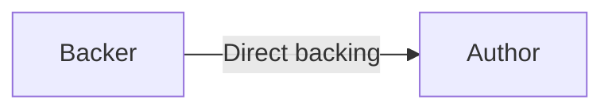
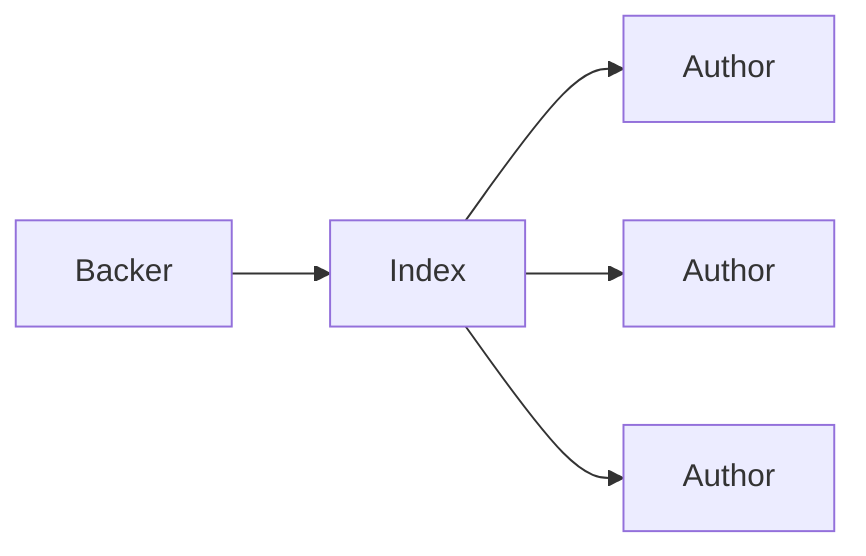
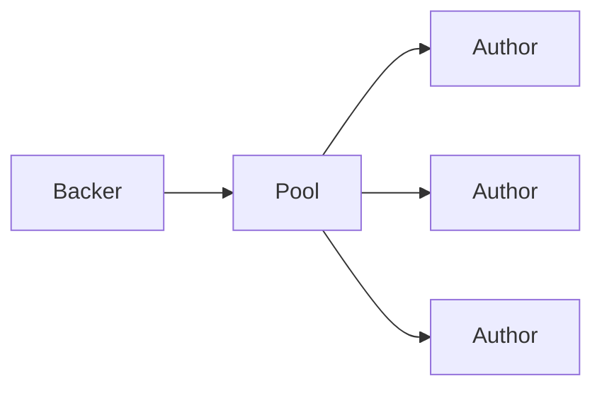
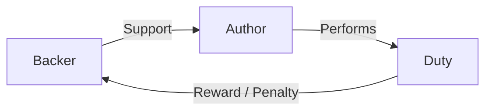
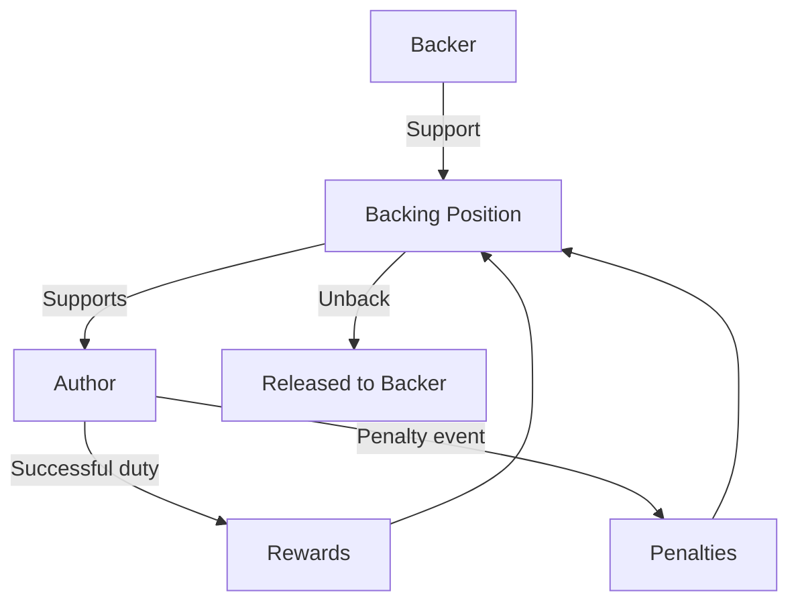

# 💸 Funding

**External funding** allows participants to economically support an Author beyond the Author's own self-collateral.

The purpose is not simply to provide more capital. It creates a way for the wider system to **support Authors it considers capable of performing a duty** and, through elections, increase the likelihood that those Authors are selected.

## 🤝 Why External Backing?

An Author's own collateral represents its personal commitment, but a protocol may benefit from allowing other participants to put their own economic position behind that Author.

External backing provides:

* **Additional economic support** for an Author.
* A way for participants to express **confidence in an Author**.
* Additional support that can contribute to the Author's **election position**.
* A mechanism for participants to share the economic consequences of an Author's participation.

The more participants that back an Author, the greater the support that Author can receive when competing for a duty.

Ultimately, it is the **duty-consuming pallet** that decides how much that support should matter and what duties should be assigned through its election requirements.

## 🧱 Funding Models

Pallet-Authors supports three ways for external backing to reach an Author. The difference is **where the backing relationship is represented** and how a backer organizes the commitment.

### 👤 Direct Backing

**Direct backing** is the simplest model: a participant directly supports a specific Author.

The backer's commitment is associated directly with that Author.

This model is useful when the backer has a specific preference:

> **“I want my economic support to stand behind this particular Author.”**

The backer and Author therefore have a direct economic relationship. The backing can contribute to the Author's election position, and the backer's position remains independently identifiable.

---

### 🗂️ Index Backing

**Index backing** allows a participant to support an **index-defined collection of Authors** rather than establishing a separate direct relationship with one Author.

The index acts as an **unmanaged collection of commitments**. The backer commits resources to the index, and the index's entries determine which Authors receive that backing.

This is useful when a participant wants to express support for a **set of Authors** without individually managing each Author relationship.

The commitment remains associated with the index, while the backing is reflected across the Authors represented by that index. 

So the distinction is:

> **Direct backing chooses the Author directly; index backing chooses the set through an index.**

---

### 🏊 Pool Backing

**Pool backing** allows support to be provided through a **managed pool**.

The pool acts as a collective funding mechanism. A participant commits resources to the pool, while a **pool manager** determines how that support is allocated among the Authors.

The pool manager selects the Authors and their corresponding **shares**, determining how the pool's backing is distributed across them.

The manager may also receive a **commission when the pool-backing is resolved**, providing an incentive to manage and maintain the pool effectively.

Unlike an index, which represents an unmanaged collection of commitments, a pool provides a **managed collective structure** for funding Authors.

> **An index represents a set of backing relationships; a pool gives a manager control over how collective backing is allocated among selected Authors.**

---

## 🔐 Commitment-Based Funding

All three models ultimately use the **commitment system** from `pallet-commitment` to represent the economic support.

The commitment is what turns funding into an actual economic position. It provides the mechanism through which the backing can be:

* **Committed** to the Author, index, or pool
* **Tracked** as an identifiable economic position
* **Increased** when additional backing is provided
* **Reduced or released** when backing is withdrawn
* **Affected by rewards or penalties** while the position remains active

When funding already exists, additional support can raise the existing commitment rather than creating an unrelated position. 

The important idea is that the three models differ in **how support is organized**, while the commitment system provides the common economic foundation underneath them.

> **Direct, index, and pool funding are different ways of expressing support; commitment is what gives that support economic substance.**

## 🗳️ Funding and Elections

External backing can directly affect how an Author competes for a duty.

If more participants support an Author, that Author can accumulate more election support. The configured election model determines how that support is interpreted.

**Flat elections** compress self-collateral and external backing into a single **influence** value.

**Fair elections** preserve the individual backing relationships and their separate weights.  

Therefore:

> **More backing can provide more support for an Author, but the duty pallet decides how that support is used to select participants.**

## ⚖️ Backers Become Economically Involved

External backing also means that a backer can become economically connected to the Author's performance.

A duty-consuming pallet may **reward or penalize external backers** because their backing represents support for the Author.

This creates a useful relationship:

The duty pallet therefore has the freedom to **reap or sow** according to the responsibility it assigns to the Author:

* Successful participation can benefit the supporting position.
* Poor or harmful participation can expose that support to penalties.

This makes backing more than passive sponsorship; it is an **economic expression of confidence**.

## 🔓 No Permanent Lock-In

External backing is not intended to permanently bind a participant to an Author.

A backer can **unback** and release its backing position according to the funding rules.

The rules governing how backing is committed, maintained, and released are provided by **`pallet-commitment`**, including the selected **balance plugin/model** used by the commitment system.

The backing relationship remains separate from the Author's own collateral, allowing external backers to exit their positions independently.

> **Pallet-Authors defines the funding relationship; `pallet-commitment` and its selected balance model govern how that commitment behaves.**

## 🔄 Rewards and Penalties Remain With the Support

Rewards and penalties associated with the Author's supported position are **redirected into the backing itself** rather than being immediately released to the backer.

They become part of the support position and remain there until the backer **unbacks**.

This keeps the economic relationship intact throughout the Author's participation:

The result is a funding model where **support, rewards, and penalties remain economically connected** until the backer chooses to leave.

> **External funding lets participants put economic weight behind an Author, participate in the consequences of that support, and leave the relationship without permanent lock-in.**
