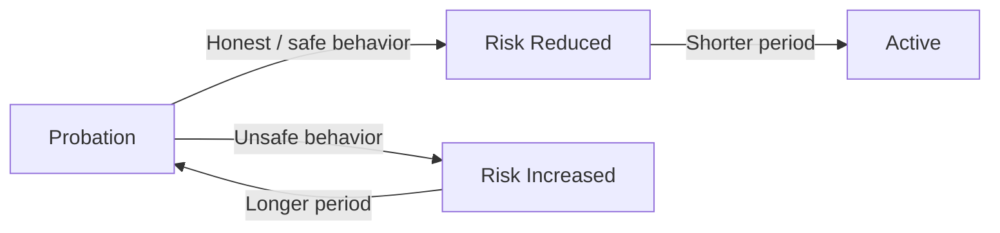

# 🕐 Probation

**Probation** is a temporary state in the Author's lifecycle used to evaluate participation and manage risk.

An Author enters **Probation** when it first enrolls. During this period, the Author may have fewer privileges and is subject to additional scrutiny before becoming **Active**.

## 🎯 Purpose of Probation

Probation provides the protocol with a controlled period in which an Author can establish that it is suitable for the role.

It is particularly important in an open system where participation is voluntary and new participants cannot simply be assumed to be trustworthy.

During probation, the Author:

* May have **limited privileges** compared with an Active Author.
* Is subject to **performance review and penalty watch**.
* Can accumulate or reduce **risk over time**.
* Must resolve its probation before gaining full standing.
* **Cannot resign** while remaining in probation.

## ⚠️ Risk Management

Probation is also used when an Author's continued participation becomes uncertain.

An **Active** Author can have its permanence placed at risk, causing it to return to **Probation**. The risk period can then be extended when further risk is introduced or reduced when the Author establishes continued suitability.

### ⏳ Probation Period

The probation period is **governed by the runtime's configuration** and can be adjusted by governance.

Governance can therefore determine how long an Author should remain under observation before being considered fully active. The period can also change dynamically as the Author's risk changes.

### 📉 Reducing Risk

Probation is not necessarily a fixed waiting period.

When an Author demonstrates honest or safe participation while under probation, its **risk can be reduced**, which in turn **reduces the remaining probation period**.

This allows a well-behaved Author to establish its standing sooner rather than always waiting for the entire initial period.

Conversely, unsafe behavior can **increase the risk period**, keeping the Author under probation for longer.

### 🔄 Risk After Becoming Active

Becoming Active does not mean that an Author can never return to probation.

An Active Author remains subject to the protocol's accountability mechanisms. If its behavior creates sufficient risk, its standing can again be placed under probation.

This creates a continuous cycle:

> **Good behavior can reduce probation -> Active -> New risk can return the Author to Probation.**

Probation is therefore both an **entry mechanism** and an ongoing **risk-control mechanism** for the role.

## 🚪 Resignation

**Resignation** is the process through which an Author voluntarily leaves the role.

An Author can **resign only while Active**. An Author in Probation cannot resign, ensuring that it cannot leave while it is still under review or has unresolved risk.

Although resignation is voluntary, **the ability to resign may be temporarily restricted by a duty pallet**. A duty pallet may require an Author to remain in the role until an assigned duty is completed, or until the obligation has otherwise been resolved.

Once an Author is permitted to resign:

* The Author leaves the role.
* Its **self-collateral is returned**.
* Its external backing remains separate from the Author's own collateral.

This ensures that voluntary resignation does not allow an Author to abandon an outstanding duty or unresolved obligation.

> **An Author must be Active to resign, but an assigned duty may temporarily prevent resignation until its obligation is fulfilled.**

## 🛡️ Accountability

Probation creates a controlled state between voluntary enrollment and unrestricted participation.

An Author must first establish its standing, and an Active Author can be returned to Probation when its continued standing becomes at risk.

At the same time, the inability to resign during probation ensures that **voluntary participation does not become a way to escape accountability**.

> **Probation gives the protocol time to evaluate an Author, manage its risk, and determine whether it should remain fully active in the role.**

## 🤝 Confidence for External Backers

Probation also gives **external backers** a way to build confidence before committing their resources to an Author.

Instead of treating every newly enrolled Author as equally established, the lifecycle provides a visible distinction between **new or at-risk Authors** and those that have demonstrated sufficient standing to become **Active**.

This helps backers evaluate whether an Author is worth supporting:

* **Probation** signals that the Author is still establishing its standing.
* **Active** signals that the Author has passed through the required probation.
* Returning to **Probation** signals that the Author's standing has become subject to renewed risk.

The lifecycle therefore gives external backers an additional signal when deciding where to provide support.

> **Probation does not guarantee honest behavior; it gives backers a protocol-defined signal of an Author's current standing and risk.**
