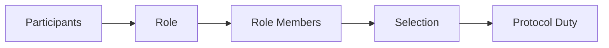

# 🎭 Roles

**Pallet-Authors implements a generalized role system** from `frame_suite::roles` for managing participants that voluntarily take on a defined protocol role.

The pallet defines **Author** as one such role: an economically-backed role with **self-collateral, external backing, lifecycle management, and elections**.

## 🧩 The Role System

A role is not merely a label attached to an account. It establishes a managed relationship between:

* A participant
* A defined responsibility
* The economic commitment associated with that responsibility
* The participant's standing within the role
* The mechanisms through which members of the role can be selected for duties

The important distinction is that **the role and the duty are separate**.

A role defines a group of participants that are eligible to perform a class of responsibilities. A duty can then require a particular number of members from that role without taking ownership of how the role itself is managed.

## 🏗️ Author as a Role

Pallet-Authors applies this generalized model to the **Author role**.

An Author is therefore not defined only by being capable of producing blocks. The role carries the machinery required to manage its members:

* **Self-collateral** establishes the participant's own economic commitment.
* **External backing** allows other participants to support a role member.
* **Lifecycle management** determines the member's standing in the role.
* **Elections** provide a way to select members of the role when a duty requires them.

These are properties of the **author-role system**, while the actual duties performed by selected Authors belong to the runtime components that consume the role.

## 🧱 Roles from the FRAME Suite

The **Author role is only one possible role** in a runtime.

Other runtime roles with similar requirements can be created from the **FRAME Suite role system**, using the same underlying role concepts while defining their own responsibilities and requirements.

This means Pallet-Authors is not limited to block authorship as a concept. **Author is one concrete role built from a more general role-management model.**

The role can therefore provide the common foundation, while the runtime decides which roles it needs and what duties those roles support.

## 🗳️ Role Membership and Selection

Because many participants can hold the same role, the role naturally forms a **candidate group**.

A protocol duty may require only a subset of that group. Instead of defining those participants permanently, the role system can provide a mechanism for selecting them from the available members.

For Authors, elections use the economic information associated with those members, including their backing, to determine the required selection.

This gives the role system an important separation:

> **The role manages the participants. The election selects from them. The duty consumes the selected participants.**

The result is a generalized model in which **roles provide managed groups of economically-backed participants**, while other parts of the runtime can use those groups to perform specific protocol duties.
