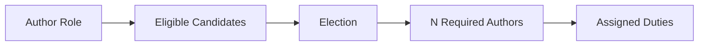
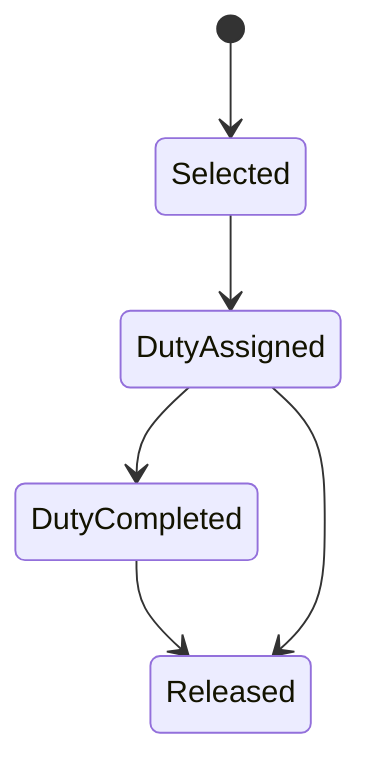
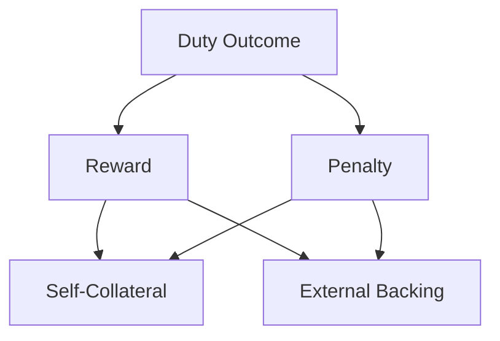
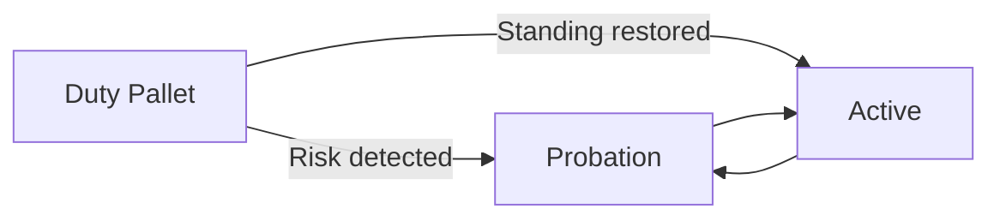

# ⚙️ Runtime

**Pallet-Authors provides the role and election machinery, while the runtime's duty pallets decide what those Authors are actually used for.**

A duty pallet can interact with the Author role to find eligible candidates, select the required participants, assign them duties, and manage their participation while those duties are active.

## 🔎 Querying Role Candidates

A duty pallet can query the Author role to obtain its eligible candidates.

It can use the available election mechanisms to select the number of Authors required for a particular duty.

The duty pallet therefore does not need to maintain its own independent candidate system. It can consume the role as the **source of eligible participants**.

## 🗳️ Conducting Elections

A duty pallet can choose either the **Flat** or **Fair** election approach according to the requirements of its duty.

It can request an election for the number of Authors it needs and use the resulting set as its active duty participants.

This allows different duties to select from the same Author role while using different interpretations of economic support.

## 🔒 Assigning and Locking Duties

Once Authors have been selected, the duty pallet can **assign duties** to them.

While an Author has an outstanding duty, the duty pallet may also **lock the Author from resigning**. This prevents the participant from abandoning an assigned responsibility before the duty has been completed or otherwise resolved.

When the duty is completed or otherwise resolved, the duty pallet can **release the Author**, allowing the normal role lifecycle to continue.

## 🎁 Rewards and Penalties

A duty pallet can also produce **rewards or penalties** based on the Author's performance.

When the duty determines that an economic consequence should apply, it can be distributed across the economic positions supporting the Author.

This can include:

* The Author's **self-collateral**
* **External backing**
* Other supported funding positions

The duty pallet therefore decides whether successful or unsuccessful performance should economically affect the people who have committed resources behind the Author.

This creates an important relationship:

> **Those who economically support an Author can also participate in the consequences of that Author's performance.**

## 🔄 Influencing the Author Lifecycle

A duty pallet can also influence an Author's **role position**.

For example, an external duty pallet can cause an Author to move:

* **Active -> Probation** when its performance creates sufficient concern.
* **Probation -> Active** when the conditions for restoring its standing have been satisfied.

This allows duty pallets to react to actual protocol activity without having to duplicate the Author lifecycle internally.

The role lifecycle therefore remains centralized in Pallet-Authors, while **duty pallets can influence that lifecycle based on the duties they control**.

## 🧩 Separation of Responsibilities

This creates a clean boundary between the role system and the runtime's actual duties:

| Pallet-Authors                 | Duty Pallet                                   |
| ------------------------------ | --------------------------------------------- |
| Manages Author membership      | Uses Author candidates                        |
| Manages collateral and backing | Conducts elections                            |
| Manages lifecycle              | Assigns duties                                |
| Provides election mechanisms   | Locks Authors during duties                   |
| Maintains role state           | Releases completed duties                     |
| Provides economic positions    | Produces rewards and penalties                |
| Provides lifecycle controls    | Can influence standing based on duty outcomes |

> **Pallet-Authors manages who the participants are; duty pallets decide what those participants do and how their performance affects the protocol.**
