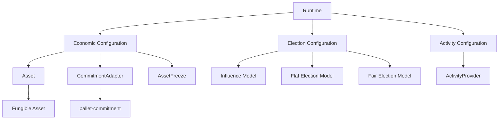

# ⚙️ Configuration

After installing `pallet-authors`, the next step is configuring **how the Author role behaves inside your runtime**.

This is where the pallet becomes runtime-specific.

The pallet itself provides the generalized role architecture:

* 👤 Author role lifecycle
* 💰 self-collateral and external funding
* ⚠️ probation and risk
* 🎁 compensation
* 🗳️ election orchestration
* 🔌 plugin boundaries

Your runtime defines:

* 💰 which asset backs the role
* 🔗 which commitment implementation manages that backing
* 📈 how economic position becomes election influence
* ⚖️ which Flat election model is used
* ⚖️ which Fair election model is used
* 🧭 how Author activity is determined
* ⛓️ how the runtime's hold/freeze reasons are represented
* ⚙️ weight and event behavior

This is done through the pallet's `Config` trait.

---

## 🧠 Configuration Philosophy

`pallet-authors` is **role infrastructure**, not a complete protocol policy.

That distinction is important.

```text
pallet-authors handles:
    role ownership + lifecycle
    collateral relationships
    funding relationships
    probation
    compensation
    election orchestration

your runtime handles:
    asset semantics
    commitment implementation
    election algorithms
    influence calculation
    activity semantics
    runtime limits and policies
```

The result is that the same Author role can be used by very different runtimes without changing the pallet itself.

---

## ⚙️ `Config` Trait

The runtime configures Authors through:

```rust
impl pallet_authors::Config for Runtime {
    ...
}
```

A representative configuration, following the pallet's runtime setup, looks like:

```rust
impl pallet_authors::Config for Runtime {
    type RuntimeEvent = RuntimeEvent;

    // Economic layer
    type CommitmentAdapter = pallet_commitment::Pallet<Self>;
    type AssetFreeze = RuntimeFreezeReason;
    type Asset = pallet_xp::Pallet<Self>;

    // Influence
    type Influence = u64;
    type InfluenceContext = ();
    type InfluenceModel = LinearModel;

    // Flat election
    type FlatElectionContext = ();
    type FlatElectionModel = flat::TopDownFlatModel;

    // Fair election
    type FairElectionContext = ();
    type FairElectionModel = fair::TopDownFairModel;

    // Runtime activity
    type ActivityProvider = DummyActivityProvider;

    // Weights + events
    type WeightInfo = ();
    type EmitEvents = ConstBool<true>;
}
```

The actual Author test runtime uses this same configuration structure, including `pallet-commitment` as the `CommitmentAdapter`, an XP asset, a linear influence model, and separate Flat and Fair election models. 

---

## 🔗 1. `CommitmentAdapter`

```rust
type CommitmentAdapter = pallet_commitment::Pallet<Self>;
```

This is the most important economic configuration.

It tells Authors **which implementation provides the commitment system for the role**.

Authors does not maintain a second accounting mechanism for:

* self-collateral
* external backing
* direct funding
* index backing
* pool backing
* rewards
* penalties
* commitment resolution

Instead:

```text
Author Role
     │
     ▼
CommitmentAdapter
     │
     ▼
pallet-commitment
     │
     ▼
Configured Balance / Asset System
```

The Commitment pallet itself is configured with its own balance family and context, so Authors remains independent of the particular accounting model chosen underneath. 

This is what allows the role system to treat economic backing as a **commitment relationship** rather than directly manipulating balances.

---

## 🪙 2. `Asset`

```rust
type Asset = pallet_xp::Pallet<Self>;
```

`Asset` identifies the fungible asset used by the Author role.

For example, a runtime could use:

```rust
type Asset = pallet_xp::Pallet<Self>;
```

or another compatible fungible implementation.

The Author pallet does not assume that its collateral is represented by a particular currency implementation.

The relationship is:

```text
Runtime Asset
      │
      ▼
Commitment
      │
      ▼
Author Economic Position
```

This also needs to correspond to the economic asset configured for the Commitment layer. The example runtime configures both Commitment and Authors against the same XP asset.  

---

## 🔒 3. `AssetFreeze`

```rust
type AssetFreeze = RuntimeFreezeReason;
```

This connects Author-level asset restrictions to the runtime's global freeze-reason type.

Authors can therefore participate in the runtime's existing asset-control system without defining a separate freeze mechanism.

Conceptually:

```text
pallet-authors
      │
      ▼
RuntimeFreezeReason
      │
      ▼
Runtime Asset System
```

The test runtime wires Authors to the same `RuntimeFreezeReason` used by the rest of the runtime. 

---

## 📈 4. `Influence`

```rust
type Influence = u64;
```

`Influence` is the value produced by the configured influence model for Flat elections.

It represents the election-facing economic weight rather than necessarily being the underlying asset balance itself.

For example:

```text
Economic Position
       │
       ▼
Influence Model
       │
       ▼
Influence
       │
       ▼
Flat Election
```

The type is therefore a runtime choice. A runtime may choose a different numeric representation if its selected model requires it.

---

## 🧮 5. `InfluenceModel`

```rust
type InfluenceModel = LinearModel;
```

The Influence Model converts an Author's economic position into its election influence.

A linear model is only one possibility.

> Utilize `frame-plugins` for various plugin templates regarding influence, falt/fair election models

A runtime could select models implementing:

* direct proportional influence
* capped influence
* diminishing influence
* threshold influence
* non-linear influence
* governance-defined weighting

The important architectural separation is:

> **Economic support does not inherently define election influence. The configured Influence plugin determines that interpretation.**

---

## 🧩 6. `InfluenceContext`

```rust
type InfluenceContext = ();
```

The context supplies runtime-specific information required by the selected Influence plugin.

A plugin that requires no additional runtime state can use:

```rust
type InfluenceContext = ();
```

A more sophisticated model can provide a dedicated plugin context.

This follows the same plugin-context pattern used by the Commitment configuration. Commitment, for example, wires its balance plugin through a dedicated `BalanceContext`. 

---

## ⚖️ 7. Flat Election

The Flat election family is configured through two associated types:

```rust
type FlatElectionContext = ();
type FlatElectionModel = flat::TopDownFlatModel;
```

The **context** supplies runtime-specific information to the election plugin.

The **model** supplies the actual election behavior.

Conceptually:

```text
Author Positions
       │
       ▼
Influence Model
       │
       ▼
Flat Election Model
       │
       ▼
Selected Authors
```

The pallet therefore does not prescribe how a Flat election must rank or select candidates.

---

## ⚖️ 8. Fair Election

Fair elections have their own independent plugin configuration:

```rust
type FairElectionContext = ();
type FairElectionModel = fair::TopDownFairModel;
```

Unlike Flat election, the Fair family can operate on the **individual backing structure** rather than first reducing an Author's support to one influence value.

```text
Author
  │
  ├── Self backing
  ├── Backer A
  ├── Backer B
  └── Backer C
        │
        ▼
Fair Election Model
        │
        ▼
Selected Authors
```

The runtime therefore configures **both** election families even if a particular duty pallet chooses to use only one of them.

The example runtime demonstrates the two independent configurations. 

---

## 🧭 9. Activity Provider

```rust
type ActivityProvider = DummyActivityProvider;
```

The Activity Provider tells Authors how the runtime determines whether an Author is currently occupied by an activity or duty.

This is intentionally external to the role itself.

For example, the test implementation provides:

```rust
impl RoleActivity<AccountId, u64> for DummyActivityProvider {
    type Activity = DummyActivity;

    fn is_idle(
        _who: &AccountId
    ) -> Result<(), DummyActivity> {
        ...
    }
}
```

This allows the Author role to enforce lifecycle operations such as resignation without needing to know what specific duty an Author is performing.

The test runtime uses exactly this separation for its dummy Author activity provider. 

---

## ⚖️ 10. `WeightInfo`

```rust
type WeightInfo = ();
```

`WeightInfo` supplies the runtime weights for Author operations.

For development or testing, `()` can be used.

A production runtime should provide its generated weight implementation where appropriate.

The important point is that computational cost remains a **runtime concern**, rather than being fixed as part of the role model.

---

## 📣 11. `EmitEvents`

```rust
type EmitEvents = ConstBool<true>;
```

This controls whether the pallet emits its runtime events.

For example:

```rust
type EmitEvents = ConstBool<true>;
```

enables event emission.

A runtime can choose the appropriate behavior for its deployment.

---

## 🔌 Putting the Configuration Together

The configuration connects the three major dimensions of Authors:



The result is a deliberately configurable role system:

> **Authors defines the role architecture; the runtime supplies the economic, election, and activity implementations that give that role its concrete behavior.**

---

## 🧪 Example Runtime Configuration

The repository's test runtime provides a complete reference configuration:

```rust
impl pallet_authors::Config for Test {
    type RuntimeEvent = RuntimeEvent;

    type CommitmentAdapter = pallet_commitment::Pallet<Self>;
    type AssetFreeze = RuntimeFreezeReason;
    type Influence = u64;
    type Asset = pallet_xp::Pallet<Self>;

    type InfluenceContext = ();
    type InfluenceModel = LinearModel;

    type FlatElectionContext = ();
    type FlatElectionModel = flat::TopDownFlatModel;

    type FairElectionContext = ();
    type FairElectionModel = fair::TopDownFairModel;

    type ActivityProvider = DummyActivityProvider;

    type WeightInfo = ();
    type EmitEvents = ConstBool<true>;
}
```

This is the concrete wiring used by the Authors test runtime. 

The important thing is not the particular models chosen here, but the **extension points** they demonstrate.

---

## 🧭 Configuration Summary

| Configuration         | What the runtime decides                               |
| --------------------- | ------------------------------------------------------ |
| `CommitmentAdapter`   | Which commitment implementation backs Author economics |
| `Asset`               | Which fungible asset is used                           |
| `AssetFreeze`         | How asset freezing is represented                      |
| `Influence`           | Representation of election influence                   |
| `InfluenceContext`    | Context available to the influence plugin              |
| `InfluenceModel`      | How economic position becomes influence                |
| `FlatElectionContext` | Context available to Flat elections                    |
| `FlatElectionModel`   | Flat election algorithm                                |
| `FairElectionContext` | Context available to Fair elections                    |
| `FairElectionModel`   | Fair election algorithm                                |
| `ActivityProvider`    | How runtime activity/duty is determined                |
| `WeightInfo`          | Runtime operation weights                              |
| `EmitEvents`          | Whether Author events are emitted                      |

This configuration is the boundary between **the generalized Author implementation** and **the policies chosen by a particular runtime**.
