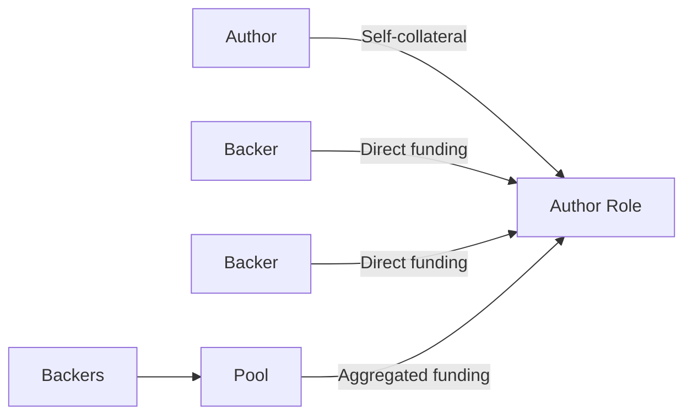
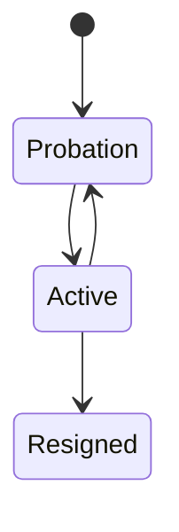

**Pallet-Authors** is a runtime pallet for managing the lifecycle and economic state of **Authors** within a substrate runtime.

An Author is primarily intended to represent a **block author**, while the duties associated with that role can be consumed by other runtime pallets. Pallet-Authors itself focuses on managing the role: **enrollment, collateral, funding, backing, probation, active participation, elections, rewards, penalties, and resignation**.

> **Pallet-Authors manages the role. Other runtime pallets consume the role's duties.**

## 🧩 What Pallet-Authors Provides

Pallet-Authors provides the infrastructure required to manage an economically-backed role throughout its lifecycle.

It brings together:

* **Role management** - enrollment, lifecycle, probation, and resignation
* **Self-collateral** - the Author's own economic commitment to the role
* **External funding** - economic backing provided by other participants
* **Funding mechanisms** - direct backing and aggregated backing through indexes or pools
* **Elections** - pluggable models for selecting Authors
* **Compensation** - rewards and penalties (via `pallet-commitment` adapter)
* **Delegated duties** - role information consumed by other runtime pallets

## 💰 Self-Collateral & External Funding

An Author begins enrollment with **self-collateral**, establishing the Author's own economic commitment to the role.

Once enrolled, an Author can also receive **external funding** from other participants. This funding can be provided directly or aggregated through mechanisms such as **indexes and pools**.



Together, self-collateral and external funding form the economic foundation of the Author role.

## 🔄 Role Lifecycle

An Author moves through a defined lifecycle:

An Author **voluntarily enrolls** into the role and initially enters **Probation**, where it has fewer privileges while its participation is evaluated.



An Author can become **Active** after probation, but may be placed back into **Probation** if its risk propagates. An Author can also voluntarily resign from the role.


## 🗳️ Pluggable Elections

Pallet-Authors does not hard-code a single election strategy.

Instead, elections are **pluggable**, allowing different models to interpret an Author's backing differently.

At a high level:

* **Flat** compresses backing into a single **influence** score.
* **Fair** preserves the individual backing contributions.

This allows the same Author management system to support different election models without changing the underlying role lifecycle.

## 🏗️ Where It Fits

Pallet-Authors sits between the Author role and the runtime components that consume it:

```text
                 Pallet-Authors
                       │
          ┌────────────┼────────────┐
          │            │            │
      Lifecycle     Economics    Elections
          │            │            │
          └────────────┼────────────┘
                       │
                  Author Role
                       │
          ┌────────────┼────────────┐
          │            │            │
      Pallet        Pallet       Pallet
Block Authoring  Author Duties   Others

```

The result is a reusable **Author role-management layer**: Pallet-Authors manages who holds the role, its economic position, funding, and lifecycle, while other runtime pallets can build their own functionality around the Author role.
