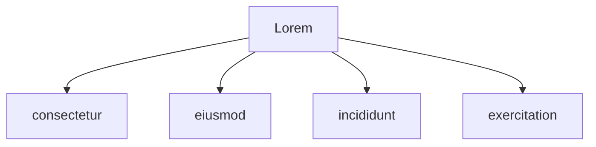

# Heading 1
## Heading 2
### Heading 3
#### Heading 4
##### Heading 5
###### Heading 6

Lorem ipsum dolor sit amet, `consectetur` adipiscing elit, sed do eiusmod tempor `incididunt` ut labore et dolore magna aliqua. Ut enim ad minim veniam, 
quis nostrud exercitation ullamco laboris nisi ut aliquip ex ea commodo consequat. 

> Lorem ipsum dolor sit amet

| Lorum                   | ipsum                     |
| ----------------------- | ------------------------- |
| `sed do eiusmod tempor` |  Ut enim ad minim veniam  |
| sed do eiusmod tempor   |  Ut enim ad minim veniam  |
| sed do eiusmod tempor   |  Ut enim ad minim veniam  |
| sed do eiusmod tempor   |  Ut enim ad minim veniam  |
| `sed do eiusmod tempor` |  Ut enim ad minim veniam  |
| sed do eiusmod tempor   |  Ut enim ad minim veniam  |




```rust
impl pallet_commitment::Config for Runtime {
    type RuntimeEvent = RuntimeEvent;

    // Core scalar types
    type Shares = u32;
    type Bias = FixedU64;
    type Time = u32;
    type Commission = Perbill;

    // Fungible asset backend
    type Asset = Xp;
    // or (use either one)
    type Asset = Balances;

    // Runtime semantic enums
    type Position = frame_suite::Disposition;
    type AssetHold = RuntimeHoldReason;
    type AssetFreeze = RuntimeFreezeReason;

    // Limits
    type MaxIndexEntries = ConstU32<15>;
    type MaxCommits = ConstU32<5>;

    // Lazy balance engine plugin & environment context
    type BalanceFamily<'a> = frame_plugins::ShareBalanceFamily<'a>;
    type BalanceContext = MyBalanceContext<Commitment>;

    // Weights + events
    type WeightInfo = pallet_commitment::weights::SubstrateWeight<Runtime>;
    type EmitEvents = ConstBool<false>;
}

// For wiring pallet environment to plugin environment
frame_suite::plugin_context!(
    name: pub MyBalanceContext,
    context: frame_plugins::ShareBalanceContext<T>,
    marker: [T],
    value: ShareBalanceContext(PhantomData)
);
```

```text
Lorem = ipsum
```
