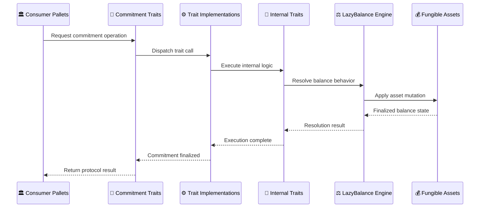

# 🏛 Overview

`pallet-commitment` is not a simple locking pallet.

It is a **trait**-driven commitment engine that provides:

- 🔒 semantic asset bonding
- 🧾 digest-level accounting
- ⚖ lazy balance resolution
- 🧺 indexed commitments
- 🏊 managed commitment pools
- ⚠ imbalance reconciliation
- 🛠 runtime-controlled balance behavior

The pallet acts as shared economic infrastructure for consumer pallets like staking, governance, escrow, lending, and contracts. 

Its responsibility is not protocol logic.

Its responsibility is safe commitment execution.

---

## 🧠 System Design

At the highest level:



Consumer pallets define business logic. `pallet-commitment` manages bonding, accounting, and resolution.

- The fungible asset system performs the actual asset mutations.
- Each layer has a strict responsibility.
- This is why the primitive remains extensible.

---

## 🎯 Responsibility Boundaries

The pallet is intentionally generic.

It does not decide:

- 🧾 what a digest means
- 💰 why funds are committed
- 🏦 how staking works
- 📉 how lending rules behave
- 🗳 governance semantics

Those belong to the **usage pallet**.

It only guarantees:

```text
safe bonding -> correct accounting -> valid resolution
```

This makes the pallet reusable across many runtime modules. 

---

## 1️⃣ Public Commitment Traits

The pallet implements the Commitment family from `frame_suite`.

Main traits include:

Trait | Responsibility | Purpose |
|---|---|---|
| `Commitment` | Core commitment lifecycle | Handles placing, raising, resolving, and withdrawing commitments across all digest models |
| `CommitIndex` | Indexed commitments | Supports index-based commitment aggregation where multiple commitments resolve through shared indexed state |
| `CommitPool` | Managed pools | Provides pool-level commitment management, redistribution, and controlled ownership semantics |
| `CommitVariant` | Commitment positional selection | Determines which commitment positional variant applies for a given digest |
| `IndexVariant` | Positional Index Entries | Defines how index entry digests differentiate and apply variant based commitments |
| `PoolVariant` | Positional Pool Slots | Defines how pool slot digests differentiate and apply variant based commitments |
| `DigestModel` | Digest classification | Defines how different commitment model's digests are classified and interpreted |
| `InspectAsset` | Read-only inspection | Exposes safe inspection APIs for fungible balances without mutation |

These are the public interfaces used by consumer pallets. 

They define:

* place / raise / resolve
* index creation
* pool management
* digest classification
* variant semantics
* inspection APIs

This is the external surface of the pallet.

---

## 2️⃣ Internal Helper Traits (Not Public)

The pallet separates low-level execution into helper traits.

Examples:

| Helper Trait|	Responsibility|
|-------------|---------------|
| `CommitBalance` |	Core balance mutation and settlement logic |
| `CommitDeposit` |	Low-level deposit execution and receipt creation |
|`CommitWithdraw` |	Low-level withdrawal execution and resolution |
|`CommitOps` |Shared commitment operations and internal state transitions |
|`CommitInspect` |	Read-only inspection of commitment state |
|`IndexOps` | Internal execution for indexed commitment structures |
|`PoolOps`	| Internal execution for managed commitment pools |

These traits are intentionally low-level, unchecked, and its implementation types are not exposed as part of the public pallet interface.

Callers must ensure invariants before using them. This keeps validation separate from execution.

These performs:

* actual deposits
* actual withdrawals
* imbalance resolution
* index distribution
* pool redistribution
* storage mutation
* balance settlement

This is where real commitment execution happens and the pallet publicly exposed trait implementations delegate here.

---

## 3️⃣ LazyBalance Engine

The pallet does not hardcode accounting logic.

Instead it implements `frame_suite::LazyBalance` trait interface.

and through plugin-driven execution from [Config](../getting-started/config.md) it takes in a `LazyBalance` compatible plugin.


```rust 
impl pallet_commitment::Config for Runtime {
    type LazyBalance<'a> = ConcreteBalancePluginModel<'a>; // Swappable model
}
```

> Not to be confused, as the pallet implements `LazyBalance` not the plugin, the plugin is expected to have behaviours expected by the pallet's `LazyBalance` implementation

This handles:

- receipt creation and resolution
- mint / reap balance mutations
- proportional rewards and penalties
- state snapshots and balance queries

Different runtimes can use different balance models without changing pallet logic. 

This is one of the most significant architectural decisions.

---

## 5️⃣ Storage Layer

Storage is split by responsibility.

Primary storage maps include:

| Storage Map  | Responsibility                                          |
| ------------ | ------------------------------------------------------- |
| `CommitMap`    | Stores proprietor ownership and active commitments      |
| `DigestMap`    | Tracks shared digest-level bonded state                 |
| `EntryMap`     | Groups commitment entries under digest ownership        |
| `IndexMap`     | Stores indexed commitment structures and references     |
| `PoolMap`      | Manages pooled commitment state and redistribution data |
| `ReasonValue`  | Tracks total committed value per commitment reason      |
| `AssetToIssue` | Records pending mint imbalance to be issued to underlying fungible system |
| `AssetToReap`  | Records pending reap imbalance to be settled to underlying fungible system |

Each one tracks a different invariant:

* ownership
* digest state
* grouped commitments
* index internals
* pool internals
* global reason accounting
* imbalance settlement

However, **storage values should not be interpreted as immediate live withdrawable value**.

`pallet-commitment` is fundamentally lazy.

Receipts, digest balances, and imbalance records represent deferred accounting state, not eagerly resolved balances.

For example:

- a receipt does not store final withdraw value
- a digest balance may require proportional resolution
- pending issue/reap values may not yet be settled into assets

This means storage reflects accounting state and protocol invariants, not always the exact real-time economic value visible to a user.

---

## 6️⃣ Native Reserve Layer

The pallet exposes very few extrinsics.

It does not expose direct user-facing commitment extrinsics.

Instead:

> consumer pallets call commitment traits.

Only an optional reserve funding is exposed directly as extrinsics:

```text
deposit_reserve()
withdraw_reserve()
```

This reserve uses:

```rust
HoldReason::PrepareForCommit
```

as the default and optional reserved funding source for all effective future commitments of a particular commitment system's [instance](../advanced/instances.md) in the runtime.

---

## 📌 Design Philosophy

The pallet is built around one principle:

> commitment logic should exist once, and be reused everywhere

Instead of every pallet building custom bonding systems:

- 🏦 staking reuses commitment
- 💸 lending reuses commitment
- 🗳 governance reuses commitment
- 📜 contracts reuses commitment

One engine. Many protocols.

This is why the architecture is heavily trait-driven.

---

## 📌 In One Sentence

> `pallet-commitment` is a reusable economic engine that separates commitment semantics from commitment execution through traits, lazy balance plugins, and strict storage invariants.

This is the architectural foundation of the pallet.

---

## 🚀 Next Step

Now we move into the base commitment architecture.

This is where the base lifecycle, storage, traits, and digest-backed commitment flow are defined.

👉 **Architecture -> [Commitment (Base)](./commitment.md)**