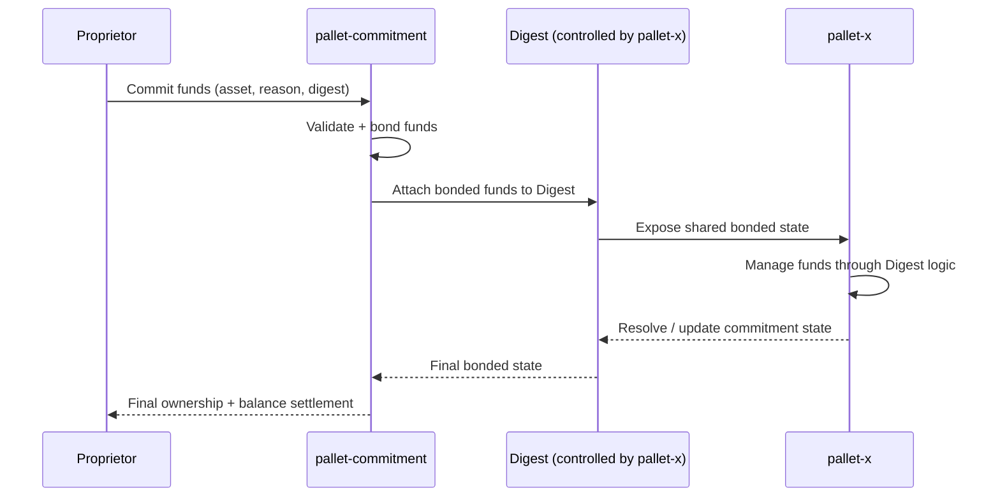

# 🎯 What is a Commitment?

A **Commitment** is the base bonding primitive of this pallet.

It allows users to bond fungible assets to a specific **Digest**, so that a usage pallet can safely access and manage all bonded funds through that digest.

At its simplest:

```text
Commitment = bond(asset) -> (reason, digest)
```

This means funds are no longer treated as normal wallet balance.

They become bonded protocol state.

---

## 🧠 What a Commitment Really Means

A commitment is not just "locking tokens."

It is a structured way to say:

> these funds now belong to this specific protocol context

The commitment pallet itself does not decide what that context is.

The **usage pallet** defines it.

Examples:

* staking pallet
* governance pallet
* lending pallet
* escrow pallet
* contracts pallet

Each pallet defines what its digest represents.

The commitment pallet only provides the safe bonding layer.

---

## 👤 Proprietor

The **Proprietor** is the account that creates and owns the commitment.

This account can:

- 📥 place the commitment (deposit)
- 📈 raise the commitment (increase)
- 📤 resolve the commitment (withdraw)

Even if many users commit to the *same digest*, each commitment still belongs to its own proprietor.

---

## 🎯 Reason

The **Reason** tells the runtime what kind of commitment this is.

This is usually a runtime [composite enum](../getting-started/install.md#-3-register-the-pallet-in-runtime) such as:

```rust
RuntimeFreezeReason
LockReason
```

where 

```rust 
convert(LockReason) -> RuntimeFreezeReason
```

Examples:

```text 
LockReason 
-> Staking
-> Governance
-> Escrow
-> Rent
-> Collateral

```
Reason answers in **compile-time** or hardcoded context:

> "Why are these funds being committed?"

It is the category of the commitment within the **usage pallet**.

---

## 🆔 Digest

The **Digest** is the most important shared object in `pallet-commitment`.

A commitment does not directly own balance. It owns a claim over a **Digest**, a unique identifier of the actual target.

It represents the object through which committed funds are accessed.

```text
Commitment = asset + reason + digest
```

The digest is where all committed value actually lives.

It is the center of:

- shared protocol state
- lazy balance resolution
- rewards and slashing
- grouped ownership
- economic entropy change

Every proprietor points to a digest where value changes defined by the usage pallet.


### Examples

#### Staking

```text
Digest = Hash(Validator / Author ID)
```

- This digest represents the validator's staking contract.
- All users committing to that validator commit to the same digest.
- The staking pallet accesses all bonded funds through that digest.

#### Smart-Contracts Rent

```text
Digest = Hash(Contract ID)
```

- This digest represents that specific smart-contracts rent funds.
- The contracts pallet manages the bonded funds through that digest.

Digest answers:

> "Which exact protocol object owns these bonded funds?"

---

## 📏 Core Rule

One important rule exists:

> One proprietor can have at most one commitment per reason

```text
(Proprietor, Reason) -> CommitInfo
```

This keeps ownership simple and deterministic.

If more complex grouping is needed, **indexes and pools** are used i.e., higher-level asbtractions on top of core-invariant.

---

## 🧭 Mental Model



This is the real purpose of a commitment. It is the access primitive for bonded funds.

---

## 📌 In One Sentence

> A commitment is the base bonding primitive that lets a usage pallet safely access and manage all bonded funds through a digest, without needing to invent its own custom system for locks, or bonded balance management.

Not just a lock. A protocol-owned economic position.

---

## 🚀 Next Step

This explains why commitments are fundamentally different from ordinary freezes and direct balance locks.

👉 **Concepts -> [Commitment vs Locks](./vs-locks.md)**
