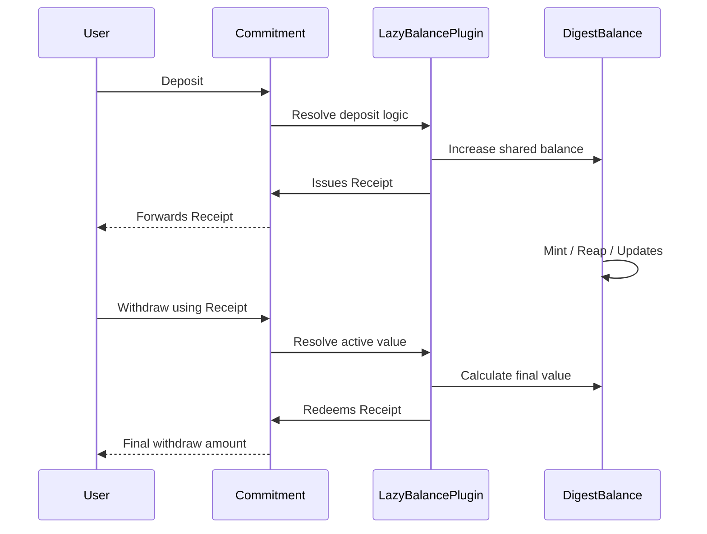

# 🔌 Lazy Balance 

The commitment pallet does not follow a fixed balance logic primitive forever.

Instead, it uses a **receipt-based lazy balance model** powered by a **Lazy Balance plugin**.

This means:

```text
Deposit(Asset) -> Issue Receipt
Balance Changes -> Update Shared State Implictly
Withdraw(Receipt) -> Resolve Final Value
```

The final withdrawable value is calculated only when the receipt is redeemed. Not every time rewards or penalties happen upon a digest.

This is called **Lazy Balance Resolution**.

The important part is:

> the pallet does not hardcode this accounting behavior

Instead, lazy balance is implemented through a **configurable plugin system**.

---

## 🧠 Why This Exists

Imagine 10,000 users committed to the same digest.

Now the protocol adds rewards:

```text
+1000 tokens
```

If every user receipt had to be updated immediately:

```text
Update receipt 1
Update receipt 2
Update receipt 3
...
Update receipt 10,000
```

that becomes expensive and inefficient.

Instead:

> only the shared digest balance changes

Receipts remain unchanged while the shared balance evolves.

When a withdrawal happens, the system derives the actual value of that specific receipt based on the current shared state, without updating any other existing receipts.

This is the main optimization of lazy balance.

Because this behavior is plugin-driven, different runtimes can define different accounting strategies without changing the pallet itself.

---

## 📥 Deposit Creates a Receipt

When a user commits funds:

```text
Alice commits 100 DOT
```

the system does two things:

### 1. Shared Balance Updates

The digest balance increases.

### 2. Receipt Is Issued

The user receives a **receipt**.

```text
Receipt = claim over bonded value
```

This receipt is not the final withdraw amount. Instead, it represents a claim over bonded value.

Its exact behavior depends on the configured Lazy Balance plugin.

Different plugins may interpret receipts differently:

- some use proportional ownership over shared balances
- some use fixed redemption rules
- some apply custom accounting logic for specific protocols

The pallet itself stays generic and does not enforce one accounting model.

---

## 🧾 A Receipt Is a Claim

A receipt stores:

* original deposit reference
* ownership entitlement
* proportional participation

It does **not** mean:

```text
Withdraw exactly 100 later
```

because the digest balance may change later.

Instead it means:

> withdraw whatever this claim is worth at resolution time

That is the lazy model.

How that value is calculated depends on the configured Lazy Balance plugin.

---

## 🔄 Shared Balance Mutations

While receipts exist, the digest balance may change.

Examples:

### Mint

```text
+ rewards
+ inflation
+ yield
```

### Reap

```text
- penalties
- slashing
- losses
```

These operations update the shared digest balance only. Existing receipts are not individually modified.

The plugin decides how minting and reaping affect receipt value.

---

## 📤 Withdraw Resolves Final Value

When a user withdraws:

```text
Withdraw(receipt)
```

the pallet asks the lazy-balance engine:

> what is this receipt worth right now?

using:

* original receipt
* current digest balance
* all mint/reap history
* proportional ownership

Only then is the final amount returned.

This is lazy resolution.

```text
receipt_active_value()
```

This is different from:

```text
receipt_deposit_value()
```

which is only the original deposited amount.

The pallet asks the configured Lazy Balance plugin:

> resolve this receipt now

and the plugin returns the final value.

---

## 🧭 Full Flow



1. Receipts wait.
2. Balances evolve.
3. Plugins define accounting.
4. Value resolves only at withdrawal.

---

## 📌 Why This Is Better

### Eager Model

```text
Every balance change updates every receipt
```

### Lazy Model

```text
Only shared balance updates
Receipts resolve later
```

This gives:

* better scalability & modularity
* cheaper protocol operations
* proportional accounting
* simple reward and penalty handling
* runtime-configurable accounting behavior

Especially useful for:

* staking systems
* index commitments
* pool commitments
* large shared digests

---

## 🧭 Mental Model

```text
Deposit = create claim

Mint/Reap = change shared state

Withdraw = resolve claim

Plugin = define accounting rules
```

- Not balance tracking.
- Claim-based accounting.
- Plugin-driven resolution.

---

## 📌 In One Sentence

> Commitments use receipts instead of fixed balances, and final value is resolved only when the receipt is withdrawn through a Lazy Balance plugin.

> Lazy balance plugins let the runtime define how receipts, deposits, withdrawals, rewards, and penalties behave without changing the pallet itself.

- The pallet provides the ownership rules.
- The configured plugin provides the accounting rules.

That is Lazy Balance Resolution.

---

## 🚀 Next Step

This explains the full journey of a commitment, from deposit and receipt creation, through balance mutations, to final withdrawal and resolution.

👉 **Concepts -> [Lifecycle](./lifecycle.md)**
