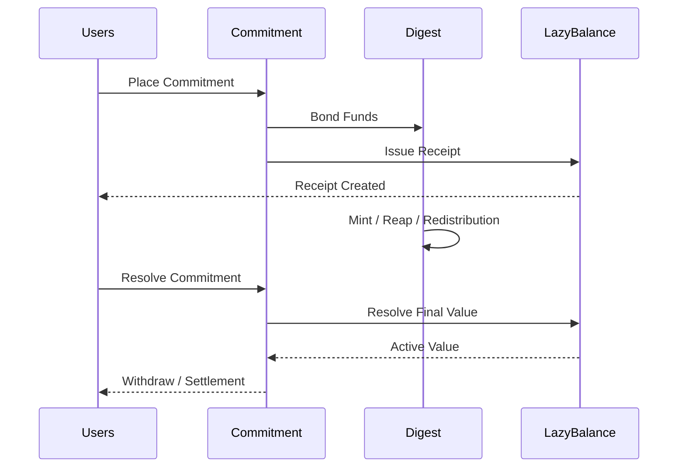

# 🔄 Lifecycle of a Commitment

A commitment is not a single action.

It moves through a full lifecycle:

```text
Place -> Raise -> Mutate -> Resolve -> Withdraw
```

From the moment funds are bonded until final settlement, the commitment behaves like a live economic position.

A user can commit to:

* 🎯 a **Direct Digest** (single target commitment)
* 🧺 an **Index Digest** (grouped weighted commitments)
* 🏊 a **Pool Digest** (managed operator-controlled commitments)

Each follows the same lifecycle, but the digest determines how the bonded value is applied.

Understanding this lifecycle is the easiest way to understand how the entire pallet works.

---

## 🧠 The Core Flow

Every commitment follows the same high-level journey:



This flow stays the same whether the system uses Direct, Index, or Pool models.

Only the digest behavior changes.

---

## 📥 Step 1 - Place Commitment

The lifecycle begins when a proprietor commits funds.

There are three ways this can happen.

### Direct Digest

The user commits directly to one digest.

Example:

```text
Alice commits 100 DOT
Reason = Staking
Digest = Validator A
```

This means:

```text
Alice -> Validator A
```

One commitment -> one digest.

### Index Digest

The user commits to an index digest.

The index contains multiple entry digests with weighted allocation.

Example:

```text
Index

BTC -> 50%
ETH -> 30%
DOT -> 20%
```

If Alice commits:

```text
100 DOT -> Index
```

the commitment is distributed proportionally across all entry digests.

This behaves like placing commitments to each digest automatically.

### Pool Digest

The user commits to a managed pool digest.

Example:

```text
Alice commits all available funds
-> Delegated Staking Pool
```

The pool controls how those funds are allocated internally.

Unlike an index, the pool actively manages:

* allocation
* commissions
* redistribution
* participation rules

This means the user commits funds to the pool, and the pool manages the rest.

### After Placing

* funds leave free (liquid) balance of user
* the digest receives bonded value
* ownership is registered

This creates the initial protocol position and the commitment now exists.

---

## 📈 Step 2 - Raise Commitment

A commitment can later be increased, regardless of what it was originally committed to.

Example:

```text
Alice adds +50 DOT
```

This does not create a new commitment.

It raises the existing one.

```text
100 DOT -> 150 DOT
```

The same proprietor, same reason, same digest.

Only the bonded value changes.

This keeps commitment ownership deterministic.

---

## 🧾 Step 3 - Receipt Ownership

Each deposit issues a receipt through the [Lazy Balance](./lazy-balance.md) system.

```text
Receipt = proof of claim
```

The receipt represents:

* ownership
* entitlement
* proportional participation

It does not mean fixed withdrawal value.

It means:

> claim over bonded value at resolution time

This is where lazy balance begins.

---

## 🔄 Step 4 - Shared State Changes

While the commitment exists, the digest state may change according to the usage pallet's independent rules.

Examples:

### Mint

```text
Rewards
Yield
Inflation
```

### Reap

```text
Slashing
Penalties
Losses
```

### Redistribution

```text
Pool reallocation
Index updates
Manager redistribution
```

These affect the shared digest state and not individual receipts.

This allows scalable accounting across many users.

---

## 🏁 Step 5 - Resolution

When the proprietor wants to exit:

```text
Resolve(receipt)
```

the system asks the [Lazy Balance Plugin](./lazy-balance.md):

> what is this commitment worth now?

using:

* receipt ownership
* current digest balance
* all mint/reap history
* redistribution state

This determines the active value of the commitment.

Not just the original deposit.

---

## 📤 Step 6 - Final Withdrawal

After resolution:

```text
Withdraw(final value)
```

the proprietor receives the final settled amount.

This may be:

* more than deposited
* less than deposited
* exactly equal

depending on protocol (**usage pallet**) behavior.

- The commitment lifecycle ends here.
- The receipt is consumed.
- The economic position closes.

---

## 📌 Why Lifecycle Matters

Without understanding lifecycle, commitment looks like "just another lock."

But it is much more:

* it evolves over time
* it participates in shared protocol state
* it resolves dynamically
* it closes through final settlement

This is why commitment is a protocol primitive, not just balance restriction.

---

## 📌 In One Sentence

> A commitment begins as bonded funds to a direct, index, or pool digest, lives as shared protocol state, and ends through receipt-based final resolution.

That is the lifecycle of a commitment.

---

## 🚀 Next Step

👉 **Architecture -> [Overview](../architecture/overview.md)**

Now that the concepts are clear, the next section explains how the pallet is internally structured.
