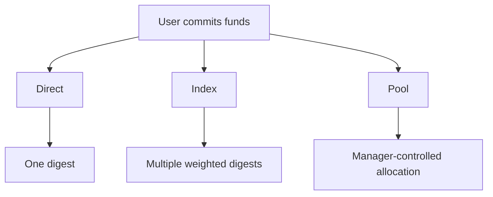

# 🏗 Direct, Index, and Pool Models

Every commitment bonds funds to a **Digest**.

But not every protocol needs the same bonding structure.

- 🎯 Some systems need one commitment to one target.
- 🧺 Some need one commitment distributed across many targets.
- 🏊 Some need managed operator-controlled allocation.

That is why `pallet-commitment` supports three digest models:

```text
Direct
Index
Pool
```

These are not different commitment systems.

They are **different ways of organizing** how bonded funds are accessed and managed. 

---

## 🧠 The Core Idea

All three models still use the same primitive:

```text
Commitment = asset + reason + digest
```

The only difference is:

> what that digest represents

Think of it like this:



The digest changes, but the commitment primitive stays the same.

---

## ✅ Direct Model

The **Direct Model** is the simplest form.

One commitment points directly to one digest.

```text 
Alice -> Validator A
```

Example:

```text
Commit 100 DOT
Reason = Staking
Digest = Validator A
```

This is ideal for:

* staking
* governance deposits
* escrow
* collateral

Simple:

```text
one commitment -> one digest
```

This is the default base model. 

---

## 🧺 Index Model

The **Index Model** is still just one commitment to one digest.

That digest is called the **Index Digest** 🧾

This is the key idea:

> the proprietor does not commit to many digests
> they commit to one digest only, the index itself

That single digest acts like a smart container that knows how to spread value across many underlying targets.

Think of it like this:

```text
Alice -> Index Digest
```

and inside that digest:

```text
BTC -> 50%
ETH -> 30%
DOT -> 20%
```

So Alice is not manually committing to BTC, ETH, and DOT one by one.

She simply commits once:

```text
Reason = Portfolio
Digest = Growth Index
```

🎯 Behind the scenes, the index digest handles the proportional distribution automatically.

It behaves as if commitments were placed individually across all entries, but the proprietor only interacts with one digest.

Perfect for:

* grouped exposure 📦
* portfolio commitments 📈
* weighted allocation strategies ⚖️

Indexes provide structure and distribution, but **not active management**.

---

## 🏊 Pool Model

The **Pool Model** is where commitments become collaborative.

Instead of every user managing commitments alone, they can commit into a shared pool managed by someone else.

Think of it like this:

```text
Users -> Pool -> Multiple Digests
```

A pool acts like a pseudo-proprietor 🤝

Users commit to the pool itself, and the pool manager redistributes those commitments across multiple digests according to the pool's strategy.

For example:

* a staking operator managing validator exposure 🏛
* a vault manager balancing positions across assets 💰
* a protocol operator handling delegated commitments ⚙️

The most important rule is:

> the manager can distribute committed funds, but cannot directly use or spend them

Their privilege is allocation, not ownership.

That is what makes pools safe 🔐

Managers guide where commitments go, but they never become the owner of user funds.

They may also take **optional commissions** for providing management, similar to staking operators or managed funds.

Pools support:

* redistribution across digests 🔄
* manager-controlled allocation 🎛
* optional commissions 💸
* delegated participation 👥

Unlike indexes:

```text
Index = structure

Pool = managed redistribution
```

Indexes define grouping. Pools actively decide how commitments flow across those grouped digests 🚀

---

## 📌 Choosing the Right Model

These models build on top of each other:

- Direct: Base single-target commitment
- Index: Grouped multi-target commitment
- Pool: Managed grouped commitment

Protocols can stay simple or scale into more complex ownership models when needed.

Each model solves a different protocol problem.

### Use Direct when:

* one proprietor -> one digest
* simple ownership is enough

### Use Index when:

* one commitment should affect many digests
* weighted distribution is needed

### Use Pool when:

* managers, commissions, or delegation are required

---

## 📌 In One Sentence

> Direct commits to one digest.
> Index distributes across many digests.
> Pool manages grouped commitments with operator control.

These are the three structural models of `pallet-commitment`.

---

## 🚀 Next Step

A commitment identifies **who** bonded and **where** it bonded.

The next section adds one more dimension:

> **what that bond represents.**

This is achieved through **Commit Variants**, which attach semantic positions to commitments within a digest.

👉 **Concepts -> [Commit Variants](./variants.md)**