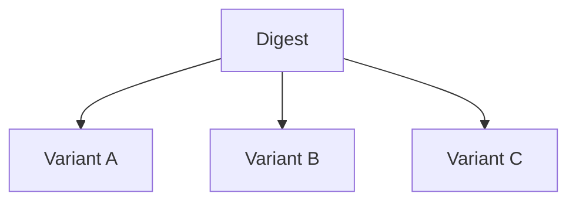

# ⚖️ Variants

A commitment is not always just about *how much* value is bonded.

Sometimes the **position itself** matters.

Examples:

* long vs short
* for vs against
* yes vs no
* positive vs negative
* bullish vs bearish

These are called **Variants**.

Variants allow the same commitment system to represent different economic meanings without changing the commitment engine itself. 

---

## 🧠 The Core Idea

A normal commitment looks like this:

```text
Commitment = asset + reason + digest
```

A commitment with variants becomes:

```text
Commitment = asset + reason + digest + variant
```

The new part is:

```text
Variant = position
```

It tells the system:

> what side of the commitment the proprietor is taking

---

## 🎯 Why Variants Exist

Without variants, every commitment to the same digest would mean the same thing.

But many protocols require opposite positions on the same target.

Example:

Same digest:

```text
Election Result
```

Different positions:

```text
YES
NO
```

Both users commit to the same digest. But their economic meaning is completely different.

That difference is carried by the **Variant**.

---

## 🆔 Example: Trading

Imagine this:

```text
Digest = BTC Price Movement
Reason = Market Position
```

Now two users commit:

### Alice

```text
Variant = Long
```

### Bob

```text
Variant = Short
```

Same digest, same reason, but different economic position.

That is exactly what variants solve.

---

## 🪺 Variants Live Inside Digests

Variants do not create separate commitments.

They create separate **positions inside the same digest**.

Think of it like this:



Example:

```text
Validator A
 |-- Positive
 |-- Negative
```

or

```text
Prediction Market
 |-- YES
 |-- NO
```

The digest remains the shared object.

Variants separate internal economic positions.

---

## 🔄 Why This Matters

Variants make it possible to support:

* prediction markets
* directional trading
* governance voting
* hedged commitments
* opposing financial positions

without creating separate commitment systems.

---

## 🧭 Mental Model

```text
Reason = what kind of commitment

Digest = what it belongs to

Variant = which side of that commitment
```

That is the complete semantic model.

---

## 📌 In One Sentence

> Variant defines the proprietor's position inside a shared digest.

It adds meaning to the commitment without changing the commitment structure.

---

## 🚀 Next Step

The Commitment engine intentionally separates ownership from financial accounting.

The next section introduces the **Lazy Balance** architecture, where commit-receipt tracking and delayed lazy settlements semantics can all be replaced by custom accounting models.

👉 **Concepts -> [Lazy Balance Plugin](./lazy-balance.md)**