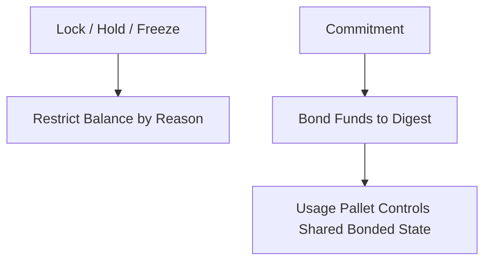

# 🔐 Commitment vs Locks

A common first question is:

> Why use commitments when Substrate (`pallet-balances`) already provides locks, holds, and freezes?

The short answer is:

- *Locks* restrict balances.
- *Commitments* provide reusable bonding primitives for protocol-owned state.

Commitment is a sophisticated abstraction built on top of raw, unsafe locks.

---

## 🧠 What Normal Locks Already Provide

Substrate (Polkadot SDK) already has:

```rust
Balances::hold(...)
Balances::freeze(...)
```

and lock systems using runtime enums like:

```rust
RuntimeFreezeReason
LockReason
```

This means locks already support a **Reason**.

For example:

```text
Alice is locked for Staking
```

The runtime knows:

* funds cannot be freely spent
* the category of the restriction (**Reason**)

This is useful for:

* transfer restrictions
* temporary holds
* reserved balances
* existential protection

Locks work well for simple balance restriction.

---

## ❗ Where Locks Stop

The problem is:

**Reason is only a category i.e., a compile-time classification**. It does not identify the actual protocol object that owns those bonded funds.

A normal lock cannot naturally answer:

* Which validator is this for?
* Which proposal does this deposit belong to?
* Which contract owns this rent deposit?
* Can many users bond to the same target?
* Can a pallet safely access all bonded funds through one shared identifier?

To support this, every pallet must build its own custom bonding system on top of locks.

That becomes repetitive, unsafe, and hard to maintain.

---

## 🎯 What Commitments Add

A commitment extends the model:

```text
Lock = asset + reason
```

becomes

```text 
Commitment = asset + reason + digest
```

The new part is:

### 🆔 Digest

Digest is a runtime-defined identifier created by the usage pallet.

It represents the exact target that owns the bonded funds.

Examples:

* validator hash
* proposal ID
* vault ID
* contract ID

This allows:

* shared ownership
* grouped bonded funds
* safe pallet-level access
* reusable bonding infrastructure

This is the real difference. 

```text
Not Reason. But `Digest`.
```

---

## 🆔 Example: Staking

### With a Normal Lock

```text
Alice locks 100 DOT
Reason = Staking
```

The runtime knows:

* Alice has restricted funds
* this is for staking

But it still does not know:

* which validator
* how Bob relates to the same validator
* how staking should manage all bonded funds together

The staking pallet must build custom logic for everything.

---

### With Commitment

```text 
Alice commits 100 DOT
Reason = Staking
Digest = Hash(Validator A)
```

Now the runtime knows:

* why funds exist (**Reason**)
* which exact validator owns them (**Digest**)
* how all nominators are grouped together

The staking pallet manages all bonded funds through that digest.

No custom bonding system is required.

---

## 🧭 Mental Model



Locks protect balances. Commitments power protocols.

---

## 📌 Practical Difference

### Locks are good for:

* preventing transfers
* temporary restrictions
* reserved balances
* simple runtime holds

### Commitments are needed for:

* staking systems
* governance deposits
* lending collateral
* escrow systems
* pooled protocol accounting
* shared bonded state across many users

If a pallet needs access to all bonded funds through many shared runtime identifiers, locks alone are not enough.

---

## 📌 In One Sentence

> Locks restrict balances using a reason.
> Commitments add runtime-defined digest-based ownership so usage pallets can safely manage shared bonded funds.

That is why `pallet-commitment` exists.

---

## 🚀 Next Step

The next section introduces **Direct**, **Index**, and **Pool** commitments, showing how the same underlying engine scales from individual commitments to weighted portfolios and non-custodial managed commitments.

These models are what make `pallet-commitment` a neccessary foundation for modern bonding protocols.

👉 **Concepts -> [Direct / Index / Pool Models](./models.md)**