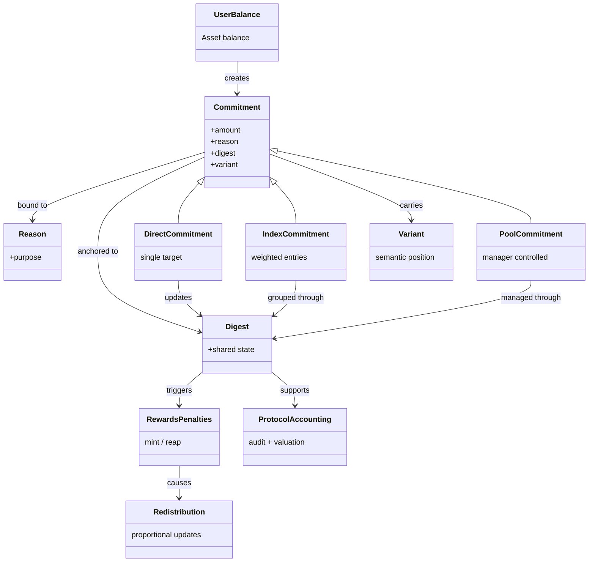

> a semantic asset commitment engine for Substrate runtimes.

This pallet extends traditional fungible balance locking by introducing **structured commitments**.

Instead of simply freezing fungible assets, balances are bonded to:

* 🎯 a purpose (**Reason**)
* 🧾 a context (**Digest**)
* 🏗 a model (**Direct / Index / Pool**)
* ⚖ a semantic position (**Variant**)

This creates a reusable infrastructure layer for staking, governance, escrow, lending, and other financial systems.

> `pallet-commitment` turns traditional balance locks into programmable financial commitments.

---

## 🚀 Why This Pallet Exists

Traditional locks are simple:

```text
Lock 100 Tokens to Reason A
```

But real protocols need more.

For example:

* staking needs validator-linked commitments
* governance needs proposal-linked deposits
* escrow needs trade-linked guarantees
* lending needs collateral-linked positions

These are not just locks. They are commitments with meaning.

This pallet provides that abstraction.

---

## 🧠 Core Idea

A commitment is:

```text
Commitment = bond(asset) -> (reason, digest)
```

Where:

* **Reason**: why the asset is committed
* **Digest**: what the commitment belongs to
* **Asset**: how much value is committed

This turns balances into structured protocol state.

Instead of managing each lock separately, the runtime works through the shared digest.

This allows:

- 📦 grouped updates across related commitments
- 🎁 shared rewards and penalties
- ⚖️ proportional redistribution
- 🧾 simpler protocol-level accounting

Result:

- ✅ less fragmented balance management
- 📈 better scalability
- 🧹 cleaner support for complex financial logic




---

# 🧩 Commitment Models

The pallet supports multiple commitment models:

## ✅ Direct Commitment

Commit directly to a single digest.

```text
Alice -> (STAKING, ValidatorDigest)
```

Best for simple staking, escrow, and deposits.

## 🧺 Index Commitment

Group multiple digests (entries) using weighted shares.

```text
ALICE -> (ESCROW, BTC) -> 50%
         (ESCROW, ETH) -> 30%
         (ESCROW, DOT) -> 20%
```

Useful for grouped exposure and portfolio-style commitments.

## 🏊 Pool Commitment

Pools are manager-controlled commitments built on top of indexes.

Users commit into a pool, and the pool operator manages how value is allocated across slots.

Example:

```
Alice commits 100 DOT -> Validator Pool

The pool has dynamic slots (digests) like:

- Validator A -> 40%
- Validator B -> 35%
- Validator C -> 25%
```

The pool operator can only adjust these shares and validators over time.

Useful for managed vaults, delegated staking, and operator-controlled financial systems.

## 🏷️ Commit Variants

Additionally, commitments can optionally carry semantic positions for models that require it, such as voting, prediction markets, or directional exposure.

Examples:

- long / short
- affirmative / contrary
- positive / negative
- yay / nay / abstain

This allows protocol-specific meaning without changing the underlying commitment engine.

---

## 🔌 Lazy Balance Plugin

Instead of executing balance operations natively, this pallet uses a **pluggable balance system** based on virtual receipts.

```
Action -> Receipt Created -> Plugin resolves final balance
```

The commitment engine records what should happen, while the balance plugin decides how balances are finalized.

This allows flexible rules such as:

- ⏰ deposits only during specific time windows
- 📏 minimum or maximum minting and withdrawals
- ✅ custom validation before settlement

Different protocols can apply different balance rules without changing the commitment engine itself.

This keeps the core simple while supporting advanced financial behavior beyond immediate balance updates.

---

## 🧱 Built for Other Pallets

This pallet is shared infrastructure, not standalone business logic.

Different pallets use commitments differently, e.g., staking, governance, lending, escrow, or managed pools, so this pallet avoids enforcing one fixed workflow.

Instead, it provides reusable building blocks.

Consumer pallets connect through traits like:

```rust
type CommitmentAdapter: Commitment<Self::AccountId>;
```

This lets each pallet define its own commitment logic while reusing the same underlying engine.

One system handles balance mechanics. Each protocol defines the meaning.

---

## 🚀 Next Steps

Not sure where to begin?

👉 **Start with [🧭 Start Here](./start)**

It helps you choose the right path based on what you want to do.